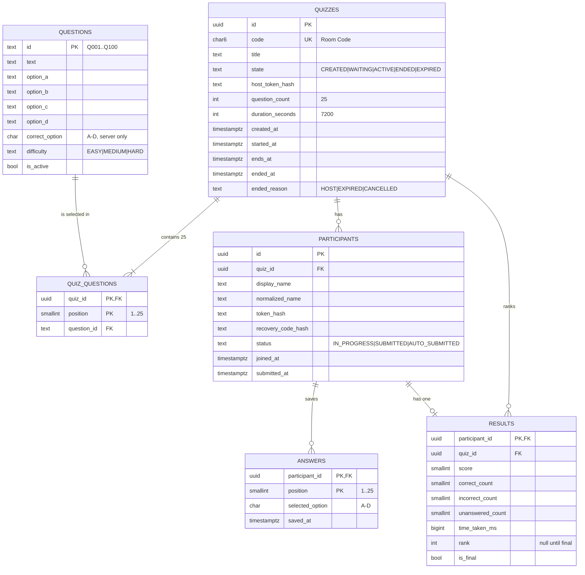

# Product Requirements Document — Quiz for IPL Auction

| | |
|---|---|
| **Version** | 1.0 (MVP) |
| **Status** | Ready for implementation |
| **Related documents** | [`Workflow.md`](./Workflow.md) · [`IPL_Quiz_Questions.md`](../data/questions/IPL_Quiz_Questions.md) · [`FILE_STRUCTURE.md`](./FILE_STRUCTURE.md) |

**Terminology used in every document**

| Term | Meaning |
|---|---|
| **Room Code** (a.k.a. Quiz ID) | The 6-character public code (`code`) participants type to join. The internal primary key is a separate UUID (`id`). |
| **Quiz** | One hosted session with exactly 25 questions and a 2-hour active window. |
| **Question Bank** | The master list of exactly 100 IPL MCQs in `IPL_Quiz_Questions.md`, seeded into the `questions` table. |
| **Quiz states** | `CREATED` → `WAITING` → `ACTIVE` → `ENDED` or `EXPIRED`. |
| **Closed quiz** | A quiz in state `ENDED` or `EXPIRED`. |
| **Participant status** | `IN_PROGRESS`, `SUBMITTED`, `AUTO_SUBMITTED`. |
| **Provisional ranking** | Ranking computed while the quiz is `ACTIVE`; visible to the host only. |
| **Final ranking** | Ranking computed once, atomically, when the quiz closes; visible to host and participants. |

---

## 1. Product Overview

### 1.1 Product name
**Quiz for IPL Auction**

### 1.2 Purpose
Provide a fast, simple, mobile-first multiplayer IPL quiz that can be run live during an IPL Auction event (for example a college fantasy-auction event), with automatic scoring and a trustworthy leaderboard.

### 1.3 Problem statement
Event organisers currently run quizzes with paper sheets or generic form tools. These make it hard to (a) give every quiz a fresh random question set, (b) enforce a strict shared deadline, (c) prevent resubmission, (d) rank participants fairly with a defined tie-break, and (e) reveal results at the exact moment the organiser chooses.

### 1.4 Proposed solution
A small web application with two roles:

- A **host** creates a quiz. The server randomly picks 25 of the 100 bank questions, stores them against the quiz, and issues a 6-character Room Code.
- **Participants** join with a name and the Room Code, answer the 25 MCQs on their phones, and submit once.
- The server owns the clock, the answer key, the scores and the ranking. The final leaderboard is revealed only when the host ends the quiz or the 2-hour timer expires.

### 1.5 Target users
| User | Description | Context |
|---|---|---|
| Host | Event organiser / student volunteer | Laptop or phone at the venue; non-technical |
| Participant | Student or auction-event attendee | Own phone (360 px+), campus Wi-Fi or mobile data, no account |

---

## 2. Goals and Objectives

| # | Goal | Measure |
|---|---|---|
| G1 | Zero-friction joining | A participant goes from the landing page to question 1 in ≤ 3 interactions (enter code, enter name, tap Join) |
| G2 | Fair, tamper-resistant scoring | 0 API responses contain a correct answer, a score before close, or a client-supplied timestamp that is trusted |
| G3 | Reliable under event load | 300 concurrent participants with p95 API latency < 500 ms (§17) |
| G4 | Resilient to disconnects | A refresh or browser reopen restores the participant with ≥ 99% of saved answers intact |
| G5 | Cheap to run | Runs on free/low-cost tiers; no paid third-party service required |
| G6 | Maintainable by students | One repository, one deployable app, one database, TypeScript end to end |

**Non-goals (MVP):** accounts and passwords, payments, multiple quiz formats, per-question timers, image questions, an admin UI for editing the question bank, analytics, native apps.

---

## 3. User Roles

### 3.1 Host
Creates and controls one or more quizzes. Identified by a **host token** issued at creation (no login). Can start, monitor and end the quiz and see provisional and final rankings.

### 3.2 Participant
Joins a quiz by Room Code with a display name or team name. Identified by a **participant token** issued at join (no login). Can answer, change answers until submission, submit once, and see the final leaderboard after the quiz closes.

### 3.3 Permission matrix

| Action | Anonymous | Participant | Host |
|---|:--:|:--:|:--:|
| View quiz public status (state, timing, participant count) | ✔ | ✔ | ✔ |
| Join quiz | ✔ | — | — |
| Read questions (without answers) | ✘ | ✔ (own quiz, `ACTIVE`, not submitted) | ✘ |
| Save answers / submit | ✘ | ✔ (own, `ACTIVE`, not submitted) | ✘ |
| Start / end quiz | ✘ | ✘ | ✔ (own quiz only) |
| View live dashboard & provisional ranking | ✘ | ✘ | ✔ |
| View final leaderboard | ✘ | ✔ (after close) | ✔ (after close) |

---

## 4. Core Features (MVP)

1. Host creates a quiz → server selects 25 random questions → Room Code issued.
2. Lobby: participants join before the host starts; late joining is allowed while `ACTIVE`.
3. Host starts the quiz → server sets `started_at` and `ends_at = started_at + 120 min`.
4. Participant quiz screen with server-synchronised countdown, one-tap answer selection and auto-save.
5. One-time submission; server computes score.
6. Host live dashboard: counts, per-participant progress, provisional ranking.
7. Host can end the quiz at any time; the quiz also closes automatically at `ends_at`.
8. Final leaderboard revealed to everyone on close.
9. Refresh/reconnect recovery for both roles.

---

## 5. Functional Requirements

Priority: **M** = must (MVP), **S** = should (MVP if time allows).

### 5.1 Quiz creation
| ID | Requirement | Pri |
|---|---|:--:|
| FR-QC-1 | Host can create a quiz with one action; an optional title (≤ 60 chars) may be given. | M |
| FR-QC-2 | On creation the server creates the quiz, selects the questions, stores them, generates the Room Code and the host token in **one database transaction**. | M |
| FR-QC-3 | The new quiz is returned in state `WAITING` (`CREATED` exists only inside the creation transaction). | M |
| FR-QC-4 | The host token is returned once, stored only as a SHA-256 hash, and shown to the host as a "host link" they can bookmark for recovery. | M |
| FR-QC-5 | Creation fails with `QUESTION_BANK_INSUFFICIENT` (503) if fewer than 25 active questions exist. | M |

### 5.2 Random question selection
| ID | Requirement | Pri |
|---|---|:--:|
| FR-QS-1 | Exactly 25 distinct questions are chosen uniformly at random from active bank questions (target bank size 100). | M |
| FR-QS-2 | Selection happens once, at creation, using a cryptographically secure RNG (`crypto.randomInt`). | M |
| FR-QS-3 | The 25 `question_id`s and their positions (1–25) are persisted in `quiz_questions`; the DB enforces `UNIQUE(quiz_id, question_id)` and `UNIQUE(quiz_id, position)`. | M |
| FR-QS-4 | Every participant of a quiz receives the same questions in the same order and with the same option order. | M |
| FR-QS-5 | The client never receives the full bank. | M |

### 5.3 Quiz room generation
| ID | Requirement | Pri |
|---|---|:--:|
| FR-RC-1 | Room Code is 6 characters from the alphabet `ABCDEFGHJKMNPQRSTUVWXYZ23456789` (31 symbols; no `0/O/1/I/L`), i.e. 31⁶ ≈ 887 million codes. | M |
| FR-RC-2 | Codes are generated with a secure RNG, are unique (DB unique index), and creation retries up to 5 times on collision. | M |
| FR-RC-3 | Lookups are case-insensitive; the server normalises input to upper case and strips spaces/hyphens. | M |

### 5.4 Quiz joining and participant registration
| ID | Requirement | Pri |
|---|---|:--:|
| FR-JN-1 | A participant joins with `code` + `displayName`. | M |
| FR-JN-2 | Joining is allowed in `WAITING` and `ACTIVE` (see decision D-3). Joining a closed quiz returns `QUIZ_CLOSED` (410). Unknown code returns `QUIZ_NOT_FOUND` (404). | M |
| FR-JN-3 | `displayName`: trimmed, 2–30 characters, Unicode letters/digits/space and `. - _ ' &`; no control characters. | M |
| FR-JN-4 | Names are unique per quiz after normalisation (NFKC, lower-case, collapsed spaces). A duplicate returns `NAME_TAKEN` (409) with the hint to use the recovery code. | M |
| FR-JN-5 | Join returns a participant token (stored hashed), a 6-character **recovery code** (stored hashed) and the participant id. | M |
| FR-JN-6 | Default participant cap per quiz is 500 (`MAX_PARTICIPANTS`); beyond that, `QUIZ_FULL` (409). | M |
| FR-JN-7 | `POST /rejoin` (name + recovery code) re-issues a participant token for the same participant, so a participant who lost local storage can resume. Rate-limited. | S |

### 5.5 MCQ answering
| ID | Requirement | Pri |
|---|---|:--:|
| FR-AN-1 | Each question shows text and four options A–D; a participant selects at most one. | M |
| FR-AN-2 | Every selection is auto-saved to the server immediately (debounced ≤ 300 ms) via `PUT /answers`. | M |
| FR-AN-3 | A participant may change or clear an answer any number of times until they submit. | M |
| FR-AN-4 | A question can be left unanswered. | M |
| FR-AN-5 | A question navigator shows answered / unanswered status for all 25 questions. | M |
| FR-AN-6 | Answers failing to save are queued in `localStorage` and retried with exponential backoff; the UI shows a "Saving… / Saved / Offline" indicator. | M |
| FR-AN-7 | Server accepts an answer write only if the quiz is `ACTIVE`, `now < ends_at`, the participant is `IN_PROGRESS`, `position ∈ 1..25` and `option ∈ {A,B,C,D,null}`. | M |

### 5.6 Timer
| ID | Requirement | Pri |
|---|---|:--:|
| FR-TM-1 | The authoritative deadline is `quizzes.ends_at`, set by the server at start: `ends_at = started_at + 7200 s`. | M |
| FR-TM-2 | Every API response includes `serverTime`; the client computes a clock offset and renders `endsAt − (clientNow + offset)`. | M |
| FR-TM-3 | The browser countdown is cosmetic. The server rejects writes after `ends_at` regardless of what the browser shows. | M |
| FR-TM-4 | The countdown survives refresh and reconnection because it is derived from `endsAt`, never from a client-side start time. | M |
| FR-TM-5 | At 0:00 the client stops accepting input, flushes pending answers once, then shows the "Quiz ended" state and polls for results. | M |
| FR-TM-6 | The timer turns to a warning style at 10 minutes and 1 minute remaining. | S |

### 5.7 Answer submission
| ID | Requirement | Pri |
|---|---|:--:|
| FR-SB-1 | `POST /submit` finalises the participant's attempt; it may carry a last snapshot of answers, applied in the same transaction. | M |
| FR-SB-2 | After submission the participant cannot save answers, read questions again, or submit again. A second submit returns the original result idempotently (`200`, same `submittedAt`), never a second attempt. | M |
| FR-SB-3 | The UI asks for confirmation if fewer than 25 questions are answered. | M |
| FR-SB-4 | `submitted_at` is the server time inside the transaction. The client never supplies it. | M |
| FR-SB-5 | The submit response does **not** include the score (revealed only after the quiz closes). | M |
| FR-SB-6 | A participant who has not submitted when the quiz closes is **auto-submitted** with their saved answers (`AUTO_SUBMITTED`). | M |

### 5.8 Score calculation
| ID | Requirement | Pri |
|---|---|:--:|
| FR-SC-1 | The server computes score by comparing stored answers to the stored answer key; the client never sends or sees a score before close. | M |
| FR-SC-2 | A provisional score is stored at submit time (powers the host's live ranking). | M |
| FR-SC-3 | At close, scores for **all** participants are recomputed from the `answers` table inside the finalisation transaction (the authoritative figure). | M |

### 5.9 Ranking
See §10 for the full rules. Ranking is computed only on the server, in SQL, using `RANK() OVER (ORDER BY score DESC, time_taken_ms ASC)`.

### 5.10 Host controls
| ID | Requirement | Pri |
|---|---|:--:|
| FR-HC-1 | Host actions require the host token: **Start**, **End Quiz**, dashboard, provisional leaderboard. | M |
| FR-HC-2 | **Start** is only valid in `WAITING` and is idempotent when already `ACTIVE`. | M |
| FR-HC-3 | **End Quiz** requires a confirmation dialog ("Participants who have not submitted will be auto-submitted. This cannot be undone."). | M |
| FR-HC-4 | **End Quiz** is valid in `ACTIVE` (finalise) and in `WAITING` (cancel; no results). It is idempotent on an already closed quiz. | M |
| FR-HC-5 | Dashboard shows: Room Code, state, time remaining, joined / in-progress / submitted counts, participant table (paginated), provisional ranking labelled "Provisional". | M |
| FR-HC-6 | The Room Code is shown large with a copy button and a join-link/QR (QR generated client-side, no external service). | S |

### 5.11 Quiz ending and expiry
| ID | Requirement | Pri |
|---|---|:--:|
| FR-EN-1 | Closing happens exactly once, in one transaction that holds a row lock on the quiz. | M |
| FR-EN-2 | The transition `ACTIVE → ENDED` is triggered by the host; `ACTIVE → EXPIRED` is triggered when any request observes `now ≥ ends_at` (lazy expiry; no scheduler required). | M |
| FR-EN-3 | Closing: sets state, `ended_at`, `ended_reason`; auto-submits unsubmitted participants; recomputes all scores; computes ranks; marks results final. | M |
| FR-EN-4 | After close, every write endpoint returns `QUIZ_CLOSED` (410). | M |
| FR-EN-5 | `ended_at` for expiry is set to `ends_at` (not the time the finalisation happened to run). | M |

### 5.12 Result visibility
| ID | Requirement | Pri |
|---|---|:--:|
| FR-RV-1 | While `ACTIVE`, participants see no scores and no leaderboard; only the host sees the provisional ranking. | M |
| FR-RV-2 | After close, participants see the final leaderboard and their own rank/score highlighted. | M |
| FR-RV-3 | Correct answers are never exposed through the API (answer review is a future enhancement). | M |
| FR-RV-4 | `resultsReady` is `false` for the brief moment between expiry and the finalisation commit; clients keep polling. | M |

### 5.13 Refresh and reconnect handling
| ID | Requirement | Pri |
|---|---|:--:|
| FR-RR-1 | Participant token and Room Code are persisted in `localStorage`; on load the app calls `GET /me` and routes to the correct screen. | M |
| FR-RR-2 | `GET /questions` returns the participant's saved answers so the UI restores exactly. | M |
| FR-RR-3 | Host token is persisted in `localStorage`; the host link (`/host/{code}#t=<token>`) restores access on any device. | M |
| FR-RR-4 | When offline, the UI shows a persistent "Connection lost – answers are saved on this device" banner, queues writes, and retries automatically when online. | M |

### 5.14 Duplicate participant handling
| ID | Requirement | Pri |
|---|---|:--:|
| FR-DP-1 | Duplicate **names** are rejected (`NAME_TAKEN`). | M |
| FR-DP-2 | Duplicate **attempts** are impossible: one participant row ⇒ one result row (`UNIQUE(participant_id)`), and status transitions are one-way. | M |
| FR-DP-3 | A user who opens a second tab with the same token acts on the same participant; last write per question wins. | M |
| FR-DP-4 | A determined user can create a second participant under a different name. MVP accepts this (no accounts); the host can see suspicious names and the quiz is team-/name-based at an event. Mitigation options are listed under future enhancements. | — |

---

## 6. Non-Functional Requirements

| Area | Requirement |
|---|---|
| **Performance** | Landing page LCP ≤ 2.5 s on a mid-range phone over 4G. Participant route ≤ 150 KB gzipped JS. API p95 ≤ 300 ms at 300 concurrent participants (excluding finalisation); autosave p95 ≤ 500 ms; finalisation of 500 participants ≤ 5 s. Question payload ≤ 15 KB. |
| **Scalability** | Designed for dozens to ~500 participants per quiz and several concurrent quizzes. Stateless app servers; all state in PostgreSQL; indexes on all hot paths; set-based SQL for scoring/ranking. |
| **Security** | Server-authoritative scoring, timer and state; hashed tokens; input validation on every endpoint; parameterised queries; rate limiting; no answer key in responses (§15). |
| **Availability** | Target 99.5% during the event window. No in-memory authority, so restarts and redeploys lose nothing. Recommended: rehearsal quiz 24 h before the event. |
| **Responsiveness** | Works from 360 px width to large desktop (§16). |
| **Accessibility** | WCAG 2.1 AA colour contrast; touch targets ≥ 44×44 px; full keyboard operation; visible focus; semantic landmarks; options are a `radiogroup`; timer announced via `aria-live="polite"` only at 30/10/5/1-minute marks and the last 10 seconds; respects `prefers-reduced-motion`; never relies on colour alone. |
| **Maintainability** | TypeScript strict mode; Zod schemas shared by client and server; services separated from route handlers; ESLint + Prettier; unit tests for scoring, ranking, timer and selection; one `.env.example`. |
| **Reliability** | Idempotent endpoints (start, end, submit); DB constraints as the last line of defence; transactions for create/finalise/submit; graceful error codes; automatic client retry with backoff. |
| **Cost** | Free tiers of a serverless host and managed PostgreSQL are sufficient for a single event (verify current limits before the event). |
| **Legal/branding** | Unofficial fan/educational project. No official IPL or franchise logos or trademarks are used; show a footer "Not affiliated with the BCCI or the IPL". |

---

## 7. User Stories

### 7.1 Host
| ID | Story | Acceptance |
|---|---|---|
| H-1 | As a host, I want to generate a quiz so that participants can join using a room code. | AC-QC-1 |
| H-2 | As a host, I want the quiz to contain 25 random questions so that every event is different. | AC-QS-1 |
| H-3 | As a host, I want to share the room code easily so that people can join in seconds. | AC-RC-2 |
| H-4 | As a host, I want to see who has joined before starting so that I can start when everyone is ready. | AC-HC-1 |
| H-5 | As a host, I want to start the quiz at a moment of my choosing so that the 2-hour timer begins when I say so. | AC-TM-1 |
| H-6 | As a host, I want to see live progress and a provisional ranking so that I can monitor the event. | AC-HC-2, AC-RK-4 |
| H-7 | As a host, I want to end the quiz early so that I can reveal results when the event moves on. | AC-EN-1 |
| H-8 | As a host, I want to recover my dashboard after a refresh or on another device so that I never lose control of a running quiz. | AC-RR-3 |
| H-9 | As a host, I want participants prevented from accessing host controls so that the quiz cannot be tampered with. | AC-SEC-3 |

### 7.2 Participant
| ID | Story | Acceptance |
|---|---|---|
| P-1 | As a participant, I want to join with just a name and a code so that I can start quickly. | AC-JN-1 |
| P-2 | As a participant, I want to see a clear countdown so that I can manage my time. | AC-TM-2 |
| P-3 | As a participant, I want my answers saved automatically so that I do not lose work if my phone sleeps. | AC-AN-2 |
| P-4 | As a participant, I want to refresh or reopen my browser and continue where I left off so that a glitch does not ruin my attempt. | AC-RR-1 |
| P-5 | As a participant, I want to change answers before I submit so that I can correct mistakes. | AC-AN-3 |
| P-6 | As a participant, I want to submit once and be told it was received so that I know I'm done. | AC-SB-1 |
| P-7 | As a participant, I want to see the final leaderboard when the quiz ends so that I know how I ranked. | AC-RV-2 |
| P-8 | As a participant, I want to join late while the quiz is running so that arriving a few minutes late does not exclude me. | AC-JN-3 |
| P-9 | As a participant, I want a clear message if the code is wrong or the quiz is over so that I know what to do. | AC-JN-2 |

---

## 8. User Flow (Lifecycle)

```text
Host → Create Quiz → Server selects 25 questions → Room Code generated (state WAITING)
     → Participants join (lobby)
     → Host presses Start → server sets started_at / ends_at (state ACTIVE)
     → Participants (and late joiners) answer → answers auto-saved
     → Participant submits (server computes provisional score)
     → Host monitors live dashboard (provisional ranking)
     → Host presses End Quiz  OR  timer reaches ends_at
     → Server locks quiz, auto-submits stragglers, recomputes scores, ranks (state ENDED / EXPIRED)
     → Final leaderboard visible to host and all participants
```

A detailed step-by-step version with diagrams is in `Workflow.md`.

---

## 9. Quiz Rules

1. The Question Bank contains exactly **100** IPL MCQs.
2. Every quiz contains exactly **25** questions selected at random from the bank when the quiz is created.
3. All questions are MCQs with exactly **4 options (A–D)** and exactly **1 correct option**.
4. A question never appears twice in the same quiz (`UNIQUE(quiz_id, question_id)`).
5. All participants in a quiz get the **same** 25 questions in the same order.
6. The quiz is active for **120 minutes**, counted by the server from the moment the host presses **Start**.
7. The server clock is authoritative; the browser timer is display-only.
8. Participants may join while the quiz is `WAITING` or `ACTIVE`; all share the same deadline `ends_at`.
9. A participant may change answers until they submit; after submitting (or auto-submission) the attempt is locked.
10. One participant record has exactly one attempt; submitting twice never creates a second attempt.
11. Scores are computed by the server only.
12. Ranking: higher score first; ties broken by shorter time taken (§10).
13. The host may end the quiz at any time; the quiz also ends automatically at `ends_at`.
14. After the quiz closes, no further answers or submissions are accepted.
15. Final rankings are visible to participants only after the quiz is closed.
16. Disconnected, refreshed or reopened sessions resume from server-saved state.
17. Correct answers are never sent to the browser.

---

## 10. Ranking Logic

### 10.1 Scoring rules (recommended and adopted)

| Case | Points |
|---|---|
| Correct answer | **+1** |
| Incorrect answer | **0** (no negative marking) |
| Unanswered | **0** |
| Maximum score | **25** |

*Rationale:* simple to explain at an event, no incentive to stop answering, no need to configure weights by difficulty. Because score = number of correct answers, the leaderboard shows only **Score**. The `correct_count`, `incorrect_count`, `unanswered_count` columns are still stored so scoring can change later (e.g. +4/−1) without a schema change.

### 10.2 Time taken (tie-break value)

```
effective_start = max(participant.joined_at, quiz.started_at)
time_taken_ms   = participant.submitted_at − effective_start
```

- Participants who joined in the lobby start counting at `started_at`; late joiners start counting at their `joined_at`, so joining late is not penalised in the tie-break.
- For auto-submitted participants, `submitted_at = quiz.ended_at` (the close time), i.e. the maximum possible time for them; any participant who explicitly submitted with the same score and the same effective start ranks ahead.

### 10.3 Ordering and rank

```sql
RANK() OVER (ORDER BY score DESC, time_taken_ms ASC)
```

- Higher score first.
- If scores are equal, **shorter `time_taken_ms` first**.
- If both are equal (rare, to the millisecond, mostly among auto-submitted participants), they share the same rank (1, 2, 2, 4 …). Display order within a shared rank is stable by `joined_at`, then `participant_id`.
- The rank stored in `results.rank` is computed once, at close, and flagged `is_final = true`. While `ACTIVE`, the host dashboard computes the same expression on the fly over submitted participants only and labels it **Provisional**.

### 10.4 Worked example

| Participant | Score | Submitted after | Rank |
|---|:--:|---|:--:|
| Team Mumbai | 22 | 41 min 12 s | 1 |
| Rahul K | 22 | 47 min 03 s | 2 |
| Chennai Kings | 20 | 18 min 40 s | 3 |
| Priya S | 20 | auto-submitted (2 h) | 4 |

---

## 11. Edge Cases

| # | Scenario | Expected behaviour |
|---|---|---|
| 1 | **Host refreshes the page** | Host token from `localStorage` (or host link fragment) is re-sent; dashboard reloads from server state. Quiz is unaffected. |
| 2 | **Host loses token** (cleared storage, new device) | Open the saved host link `/host/{code}#t=<token>`. Without it the quiz cannot be controlled (documented limitation; it will expire automatically after 2 h if started). |
| 3 | **Participant refreshes** | `GET /me` + `GET /questions` restore position, answers and timer. |
| 4 | **Participant loses internet** | UI shows offline banner; answers are queued locally and flushed on reconnect; if the quiz closes while offline, the queued answers are rejected (`QUIZ_CLOSED`) but everything saved before close counts. |
| 5 | **Participant joins after quiz starts** | Allowed (D-3). They get the same questions and the same `ends_at`. |
| 6 | **Participant joins a closed quiz** | `QUIZ_CLOSED` (410) with message and (if they are already a participant) a link to the leaderboard. |
| 7 | **Participant submits twice** (double tap, retry, two tabs) | Second request returns `200` with the original `submittedAt`; no second attempt, no state change. |
| 8 | **Host ends quiz early** | Closing transaction runs; stragglers auto-submitted; participants' next poll/save response shows `ENDED`; leaderboard appears. |
| 9 | **Timer reaches zero** | Client stops input and flushes; server rejects writes after `ends_at`; first request after `ends_at` triggers finalisation (`EXPIRED`). |
| 10 | **Same score** | Tie broken by shorter `time_taken_ms`; exact ties share a rank. |
| 11 | **Invalid room code** | Format error → `VALIDATION_ERROR` (400); well-formed but unknown → `QUIZ_NOT_FOUND` (404) with friendly "Check the code and try again". |
| 12 | **Room already closed** | Status endpoint returns state `ENDED`/`EXPIRED`; join returns `QUIZ_CLOSED`; UI shows the closed screen. |
| 13 | **Server restarts during an active quiz** | No in-memory authority; the next request reads state from PostgreSQL. `ends_at` is stored, so the timer is unaffected. Clients retry with backoff. |
| 14 | **Large number of participants join simultaneously** | Joins are single-row inserts guarded by a unique index; cap enforced via a counted insert in one statement; join endpoint has a generous per-IP limit (campus NAT); connection pool is bounded; status responses are micro-cached for 1–2 s. |
| 15 | **Two participants choose the same name at the same instant** | One insert wins on `UNIQUE(quiz_id, normalized_name)`; the other receives `NAME_TAKEN`. |
| 16 | **Answer arrives at the same moment the host presses End** | Answer writes take a shared lock on the quiz row; closing takes an exclusive lock. Whichever acquires first wins; an answer committed before close counts, one after is rejected. No answer is half-counted. |
| 17 | **Host presses Start twice** | Idempotent: second call returns the same `startedAt`/`endsAt`. |
| 18 | **Participant tries host endpoints** | `401/403`; host token is a different secret and never issued to participants. |
| 19 | **Participant tampers with the client** (fake score, fake time) | Server ignores client-supplied scores/time; it accepts only `{position, option}`. |
| 20 | **Participant's phone clock is wrong** | Countdown uses server-time offset; deadline enforcement is server-side. |
| 21 | **Database call fails** | `500 INTERNAL`; client keeps pending answers and retries with exponential backoff (1 s → 30 s cap); no partial commits because writes are transactional. |
| 22 | **Host ends a quiz that was never started** | Treated as cancel: state `ENDED`, no results; participants see "Quiz cancelled by host". |
| 23 | **No one submits** | At close, all participants are auto-submitted with whatever they saved (possibly zero). |
| 24 | **Question bank smaller than 25 active questions** | Creation refused (503) with a clear admin message. |

---

## 12. Technical Recommendations

### 12.1 Evaluation of options

**Overall architecture**

| Option | Pros | Cons | Verdict |
|---|---|---|---|
| **A. Next.js monolith (UI + API route handlers) + PostgreSQL, polling** | One repo, one deploy, TypeScript everywhere, works on serverless free tiers, stateless | Polling adds a few seconds of latency; per-request DB connections need pooling | **Chosen** |
| B. React SPA + Express + Socket.IO + MongoDB | True push updates | Needs an always-on server (free tiers may sleep → risky at a live event), sticky sessions to scale WebSockets, weaker transactional guarantees for "exactly one submission" | Rejected |
| C. Firebase / BaaS with realtime listeners | Realtime for free, no server | Server-authoritative scoring and answer-key secrecy need Cloud Functions + complex security rules; vendor lock-in; harder to test | Rejected |
| D. Microservices / queue / Redis | Scales hugely | Massive over-engineering for ≤ 500 users | Rejected |

**Database**

| Option | Verdict | Reason |
|---|---|---|
| **PostgreSQL** | **Chosen** | Real transactions, row locks (`FOR UPDATE` / `FOR SHARE`), unique constraints, window functions (`RANK()`), good free managed tiers |
| MySQL | Viable | No advantage here; fewer free managed options |
| MongoDB | Rejected | Relational data (quiz ↔ questions ↔ participants ↔ answers); needs multi-document transactions for the same guarantees |

**Real-time**

| Option | Verdict |
|---|---|
| **Short polling with adaptive intervals** | **Chosen** — simplest, works through campus proxies/firewalls, serverless-friendly, trivially recoverable after disconnects |
| Server-Sent Events | Rejected for MVP — long-lived connections are awkward on serverless platforms; one-way only |
| WebSockets / Socket.IO | Rejected for MVP — requires stateful server; not needed since only 3 pieces of data need to be near-real-time |

### 12.2 Recommended stack

| Layer | Choice | Why |
|---|---|---|
| Language | TypeScript (strict) | Shared types and validation between client and server |
| Framework | **Next.js (App Router)** with React | Pages + API route handlers in one project; fast first load via server components |
| Styling | Tailwind CSS | Mobile-first utilities; small CSS output; easy theming |
| Validation | Zod | One schema per endpoint, reused on client |
| ORM | Prisma (raw SQL via `$queryRaw` for locking and ranking) | Typed models, migrations, seed; escape hatch for `FOR UPDATE` / `RANK()` |
| Database | PostgreSQL (managed free tier, e.g. Neon or Supabase Postgres; or a Docker Postgres on a small VM) | See above |
| Hosting | Vercel (or any Node host) + managed Postgres. Use the provider's **pooled** connection string | Free/low-cost, zero-ops. Verify current free-tier limits and terms before the event |
| Tests | Vitest (unit/integration), Playwright (end-to-end), k6 (load rehearsal) | Light and student-friendly |
| CI | GitHub Actions: lint, typecheck, unit tests | Free |

### 12.3 Where real-time updates are actually needed

| Data | Needs near-real-time? | Mechanism |
|---|---|---|
| Quiz started (lobby → active) | Yes (within ~10 s) | Participant polls `GET /quizzes/{code}` every 8 s ± 2 s jitter in lobby |
| Participant count / list in lobby (host) | Soft | Host polls dashboard every 5 s |
| Quiz ended (host ended or expired) | Yes (within ~30 s) | Every answer-save response carries `state`; participants also poll every 30 s; client countdown triggers an immediate check at 0:00 |
| Host live ranking | Soft | Host polls dashboard every 5 s, paginated |
| Answers | No | Plain `PUT` on selection |
| Final leaderboard | No | One fetch after close (`resultsReady = true`) |

Estimated steady load for 300 participants: ≈ 10 status requests/s during the quiz and ≈ 40/s in the lobby burst, plus autosave writes; all are indexed single-row or small queries.

### 12.4 Hosting considerations
- Use one region close to the venue (e.g. Mumbai/Singapore if available) for both app and database to minimise latency.
- Use the database provider's connection pooler and keep the per-instance pool small (e.g. 3–5).
- Run a rehearsal quiz and a k6 load test with ~300 virtual users the day before.

---

## 13. Database Design

PostgreSQL. All timestamps are `timestamptz` and are written using the database clock (`now()` / `clock_timestamp()`), never client values.

### 13.1 Entity-relationship diagram



### 13.2 Tables

**`questions`** — the master bank (seeded from `IPL_Quiz_Questions.md`).

| Column | Type | Notes |
|---|---|---|
| `id` | `text` PK | `Q001`–`Q100` |
| `text` | `text` NOT NULL | Question text |
| `option_a` … `option_d` | `text` NOT NULL | Four options |
| `correct_option` | `char(1)` NOT NULL | `CHECK IN ('A','B','C','D')`; **never selected by participant-facing queries** |
| `difficulty` | `text` NOT NULL | `EASY/MEDIUM/HARD` |
| `is_active` | `boolean` default true | Allows retiring a question without deleting history |

**`quizzes`**

| Column | Type | Notes |
|---|---|---|
| `id` | `uuid` PK | Internal |
| `code` | `char(6)` UNIQUE | Room Code |
| `title` | `text` null | ≤ 60 chars |
| `state` | `text` NOT NULL | Check constraint on the 5 states |
| `host_token_hash` | `text` NOT NULL | SHA-256 of the host token |
| `question_count` | `smallint` default 25 | |
| `duration_seconds` | `int` default 7200 | |
| `created_at` | `timestamptz` default `now()` | |
| `started_at`, `ends_at` | `timestamptz` null | Set on start; `ends_at = started_at + duration` |
| `ended_at` | `timestamptz` null | Close time (for expiry equals `ends_at`) |
| `ended_reason` | `text` null | `HOST`, `EXPIRED`, `CANCELLED` |

**`quiz_questions`** — the 25 questions fixed for a quiz.
PK `(quiz_id, position)`, `UNIQUE (quiz_id, question_id)`, `CHECK (position BETWEEN 1 AND 25)`.

**`participants`**

| Column | Type | Notes |
|---|---|---|
| `id` | `uuid` PK | |
| `quiz_id` | `uuid` FK → quizzes | `ON DELETE CASCADE` |
| `display_name` | `text` | As entered (trimmed) |
| `normalized_name` | `text` | NFKC, lower-case, collapsed spaces |
| `token_hash`, `recovery_code_hash` | `text` | SHA-256 hashes |
| `status` | `text` | `IN_PROGRESS` → `SUBMITTED` \| `AUTO_SUBMITTED` (one-way) |
| `joined_at` | `timestamptz` | |
| `submitted_at` | `timestamptz` null | Server time |
| Constraint | `UNIQUE (quiz_id, normalized_name)` | Duplicate-name protection |

**`answers`** — PK `(participant_id, position)`; `selected_option CHECK IN ('A','B','C','D')`; a cleared answer is a deleted row. Writes use `INSERT … ON CONFLICT (participant_id, position) DO UPDATE`.

**`results`** — one row per participant (`participant_id` PK ⇒ **no second attempt is physically possible**).

| Column | Notes |
|---|---|
| `score`, `correct_count`, `incorrect_count`, `unanswered_count` | Server-computed |
| `time_taken_ms` | See §10.2 |
| `rank` | `null` until final |
| `is_final` | `false` for provisional rows; `true` after close |

### 13.3 Indexes

| Index | Purpose |
|---|---|
| `quizzes(code)` UNIQUE | Join/status lookups |
| `participants(quiz_id, normalized_name)` UNIQUE | Duplicate names |
| `participants(quiz_id, status)` | Dashboard counts |
| `results(quiz_id, score DESC, time_taken_ms ASC)` | Leaderboard ordering |
| `quiz_questions(quiz_id, position)` PK | Question list |
| `answers(participant_id, position)` PK | Fast upsert, restore |

### 13.4 Relationships (summary)
- A **Quiz** has exactly 25 **QuizQuestions**, each pointing at one **Question** from the bank.
- A **Quiz** has many **Participants**; a **Participant** has up to 25 **Answers** and exactly one **Result** (created at submit/auto-submit).
- Scoring joins `answers → quiz_questions (same quiz, same position) → questions.correct_option`.

---

## 14. API Requirements

Base path: `/api/v1`. JSON only. Every response body includes `serverTime` (ISO-8601, UTC). Auth is a bearer token in `Authorization: Bearer <token>`.

**Standard error body**

```json
{ "error": { "code": "QUIZ_CLOSED", "message": "This quiz has ended." }, "serverTime": "2026-03-01T10:15:30.120Z" }
```

| Code | HTTP | Meaning |
|---|---|---|
| `VALIDATION_ERROR` | 400 | Bad input shape/format |
| `UNAUTHORIZED` | 401 | Missing/invalid token |
| `FORBIDDEN` | 403 | Token valid but not allowed (e.g. participant on host route, results not yet available) |
| `QUIZ_NOT_FOUND` | 404 | Unknown Room Code |
| `NAME_TAKEN` | 409 | Duplicate display name in this quiz |
| `QUIZ_FULL` | 409 | Participant cap reached |
| `INVALID_STATE` | 409 | Action not allowed in the current quiz state (e.g. `QUIZ_NOT_STARTED`) |
| `ALREADY_SUBMITTED` | 409 | Write/read not allowed after submission |
| `QUIZ_CLOSED` | 410 | Quiz is `ENDED`/`EXPIRED` |
| `RATE_LIMITED` | 429 | Too many requests |
| `INTERNAL` | 500 | Unexpected error |
| `QUESTION_BANK_INSUFFICIENT` | 503 | Fewer than 25 active questions |

### 14.1 Endpoint summary

| # | Method | Route | Auth | Purpose |
|---|---|---|---|---|
| 1 | POST | `/quizzes` | none (rate-limited) | Create quiz |
| 2 | GET | `/quizzes/{code}` | none | Public status (polling) |
| 3 | POST | `/quizzes/{code}/start` | host | Start quiz |
| 4 | POST | `/quizzes/{code}/end` | host | End quiz |
| 5 | GET | `/quizzes/{code}/host/dashboard` | host | Live dashboard |
| 6 | POST | `/quizzes/{code}/join` | none (rate-limited) | Join quiz |
| 7 | POST | `/quizzes/{code}/rejoin` | none (rate-limited) | Recover participant |
| 8 | GET | `/quizzes/{code}/questions` | participant | Questions + saved answers |
| 9 | PUT | `/quizzes/{code}/answers` | participant | Save answers (idempotent, batch) |
| 10 | POST | `/quizzes/{code}/submit` | participant | Final submit |
| 11 | GET | `/quizzes/{code}/me` | participant | Resume/own state |
| 12 | GET | `/quizzes/{code}/leaderboard` | participant or host | Paginated leaderboard |
| 13 | GET | `/health` | none | Liveness + DB check |

### 14.2 Endpoint details

#### 1. `POST /quizzes` — create quiz
- **Request:** `{ "title"?: string(≤60) }`
- **Response `201`:**
  ```json
  { "code": "K7M2QX", "title": "Auction Night", "state": "WAITING",
    "questionCount": 25, "durationSeconds": 7200,
    "hostToken": "<43-char base64url>", "createdAt": "…", "serverTime": "…" }
  ```
- **Validation:** title trimmed and length-checked; ≥ 25 active questions; per-IP rate limit (e.g. 10/min). Selection, code and token creation in one transaction.

#### 2. `GET /quizzes/{code}` — public status
- **Response `200`:** `{ code, title, state, resultsReady, startedAt, endsAt, participantCount, questionCount, serverTime }`
- **Validation:** code format; unknown → 404. If `state = ACTIVE` and `now ≥ ends_at`, triggers finalisation (non-blocking: uses `NOWAIT`; if another request is finalising, returns `state: "EXPIRED"`, `resultsReady: false`).
- Never returns hashes, questions or answers.

#### 3. `POST /quizzes/{code}/start` — host
- **Request:** none.
- **Response `200`:** `{ state: "ACTIVE", startedAt, endsAt, serverTime }`
- **Validation:** valid host token for this quiz; state `WAITING` (or already `ACTIVE` ⇒ idempotent success); closed ⇒ `QUIZ_CLOSED`.
- Sets `started_at = clock_timestamp()`, `ends_at = started_at + duration`.

#### 4. `POST /quizzes/{code}/end` — host
- **Request:** none. **Response `200`:** `{ state: "ENDED", endedAt, resultsReady: true, participantCount, serverTime }`
- **Validation:** host token; allowed in `ACTIVE` (finalise) and `WAITING` (cancel, `ended_reason = CANCELLED`, `resultsReady` true with empty leaderboard); idempotent when already closed.

#### 5. `GET /quizzes/{code}/host/dashboard` — host
- **Query:** `limit` (1–100, default 50), `offset` (≥ 0), `sort` (`rank` default | `name`).
- **Response `200`:**
  ```json
  { "state": "ACTIVE", "endsAt": "…", "isFinal": false,
    "counts": { "joined": 212, "inProgress": 140, "submitted": 70, "autoSubmitted": 2 },
    "rows": [ { "rank": 1, "participantId": "…", "name": "Team Mumbai", "status": "SUBMITTED",
                "answered": 25, "score": 22, "incorrect": 3, "timeTakenMs": 2472000 },
              { "rank": null, "participantId": "…", "name": "Rahul K", "status": "IN_PROGRESS",
                "answered": 14, "score": null, "incorrect": null, "timeTakenMs": null } ],
    "page": { "limit": 50, "offset": 0, "total": 212 }, "serverTime": "…" }
  ```
- **Validation:** host token; numeric bounds. `isFinal` is `true` once the quiz is closed.

#### 6. `POST /quizzes/{code}/join`
- **Request:** `{ "displayName": string(2–30) }`
- **Response `201`:** `{ participantId, participantToken, recoveryCode, displayName, state, serverTime }`
- **Validation:** state `WAITING` or `ACTIVE`; name rules (§5.4); uniqueness; participant cap; rate limit. Insert is conflict-safe (`ON CONFLICT DO NOTHING` ⇒ `NAME_TAKEN`).

#### 7. `POST /quizzes/{code}/rejoin`
- **Request:** `{ "displayName": string, "recoveryCode": string(6) }`
- **Response `200`:** `{ participantId, participantToken, displayName, status, state, serverTime }`
- **Validation:** hash comparison (constant-time); strict rate limit (5/min per IP + name). Old token is invalidated (replaced).

#### 8. `GET /quizzes/{code}/questions` — participant
- **Response `200`:**
  ```json
  { "questions": [ { "position": 1, "text": "…", "options": { "A": "…", "B": "…", "C": "…", "D": "…" } } ],
    "answers": { "1": "B", "4": "D" }, "endsAt": "…", "serverTime": "…" }
  ```
- **Validation:** participant token for this quiz; state must be `ACTIVE` (`WAITING` ⇒ `INVALID_STATE`; closed ⇒ `QUIZ_CLOSED`); status `IN_PROGRESS` (else `ALREADY_SUBMITTED`). Query selects explicit columns and **never** `correct_option`. Response header `Cache-Control: private, no-store`.

#### 9. `PUT /quizzes/{code}/answers` — participant
- **Request:** `{ "answers": [ { "position": 1..25, "option": "A"|"B"|"C"|"D"|null } ] }` (1–25 items, unique positions)
- **Response `200`:** `{ saved, answeredCount, state, endsAt, serverTime }`
- **Validation:** token; `ACTIVE` and `now < ends_at` evaluated **after** taking a shared lock on the quiz row; status `IN_PROGRESS`; Zod schema; `null` deletes the answer. Idempotent. If the deadline has passed ⇒ `QUIZ_CLOSED` (and finalisation is triggered).

#### 10. `POST /quizzes/{code}/submit` — participant
- **Request:** `{ "answers"?: [ … same shape as #9 … ] }` (optional final snapshot)
- **Response `200`:** `{ status: "SUBMITTED", submittedAt, answeredCount, serverTime }` — **no score**.
- **Validation:** token; `ACTIVE` and before `ends_at`; in one transaction: lock participant row, apply optional snapshot, set `status = SUBMITTED`, `submitted_at`, compute and upsert provisional `results`. If already submitted ⇒ `200` with original `submittedAt` (idempotent).

#### 11. `GET /quizzes/{code}/me` — participant
- **Response `200`:** `{ participantId, displayName, status, answeredCount, state, resultsReady, startedAt, endsAt, result?: { rank, score, maxScore: 25, timeTakenMs }, serverTime }`
- `result` is present **only** when the quiz is closed and `resultsReady`.

#### 12. `GET /quizzes/{code}/leaderboard`
- **Query:** `limit` (1–100, default 50), `offset`.
- **Response `200`:** `{ isFinal, rows: [ { rank, name, score, timeTakenMs, isYou? } ], page: { limit, offset, total }, serverTime }`
- **Authorisation:** closed quiz and `resultsReady` ⇒ participant or host token of this quiz. `ACTIVE` ⇒ host token only (`isFinal: false`); participants get `FORBIDDEN`. No answers, no tokens, no per-question data.

#### 13. `GET /health`
- `200 { status: "ok", db: "ok" }` or `503`. Used by uptime monitor/rehearsal.

---

## 15. Security Considerations

| Concern | Control |
|---|---|
| **Server-side score calculation** | Scores computed by SQL from `answers` and `questions.correct_option`; no endpoint accepts a score; clients never see the key. |
| **Server-side timer validation** | `ends_at` stored in DB; every write checks `clock_timestamp() < ends_at` after acquiring the quiz-row lock. |
| **Input validation** | Zod on every route; length/charset limits; Room Code normalised and format-checked; JSON body size limit (e.g. 8 KB). |
| **Duplicate submissions** | One-way status transitions, `UNIQUE(participant_id)` on results, row locks, idempotent submit. |
| **Basic abuse prevention** | Per-IP rate limits (best-effort in-process limiter plus the hosting platform's rate-limit/firewall rule). Limits are generous for join/save because a whole campus may share one IP; strict for `rejoin` (brute-force of recovery codes) and `POST /quizzes`. Participant cap per quiz. |
| **Protected host controls** | Host token: 32 random bytes, base64url, shown once, only its SHA-256 hash stored, compared with `timingSafeEqual`. Host routes also check the token belongs to *that* quiz. Participants never receive it. |
| **Quiz room authorisation** | Participant token is bound to one participant in one quiz; every participant route verifies the quiz in the URL matches the token. |
| **Answer key exposure** | `correct_option` only appears in server-side scoring SQL; DTO mappers whitelist fields; automated test asserts no participant/public response contains `correct` or `answer key` fields. The question source file lives outside `public/`. |
| **Token handling** | Sent via `Authorization` header (not URL query); host-link fragment (`#t=`) is never sent to the server and is stripped from the address bar after being stored. |
| **XSS / injection** | React escapes output; no `dangerouslySetInnerHTML`; names are plain text; Prisma/parameterised SQL only; strict CSP and security headers (`X-Content-Type-Options`, `Referrer-Policy`, `frame-ancestors 'none'`). |
| **Transport & CORS** | HTTPS only (HSTS); API is same-origin, no wildcard CORS. |
| **Secrets** | `DATABASE_URL` and any pepper in environment variables; `.env` is git-ignored; `.env.example` committed. |
| **Privacy** | Only a display name is stored; no email/phone. Optional purge of quizzes older than 30 days. |
| **Known accepted risks** | Shared question order allows answer sharing among people sitting together; multiple accounts under different names possible. Mitigations are in §18 (future). |

---

## 16. Responsive Design Requirements

**Visual identity.** Deep navy background (`#0B1F3A`), vivid orange accent (`#F58220`), gold highlight (`#F7C948`), off-white text; cricket-ball and stumps line icons (generic, not official marks). One heading font and one body font (system or a single self-hosted web font), no decorative animation (only a simple state change on option selection), `prefers-reduced-motion` respected. All text/background pairs ≥ 4.5:1.

| Aspect | Mobile (360–599 px) | Tablet (600–1023 px) | Desktop (≥ 1024 px) |
|---|---|---|---|
| Layout | Single column; sticky top bar (timer + progress); sticky bottom bar (Prev / Next / Submit) | Single centred column (max 680 px), side padding | Two columns for the quiz: question card + sticky question navigator panel; host dashboard uses full table |
| Options | Full-width stacked buttons, ≥ 56 px tall | Same, larger type | Same, with keyboard shortcuts 1–4 / A–D |
| Question navigator | Bottom sheet opened by "1–25" button | Collapsible strip | Always-visible 5×5 grid |
| Leaderboard | Card list (rank, name, score, time); sticky "You" row | Table with 4 columns | Full table with optional extra host columns |
| Host dashboard | Stacked summary cards + card list | Summary cards + table | Summary strip + full table + side panel with Room Code/QR |
| Typography | Body ≥ 16 px (prevents iOS zoom); question text 18–20 px | 18 px body | 18–20 px body |
| Touch targets | ≥ 44 × 44 px with ≥ 8 px spacing | Same | Same; hover/focus states |
| Room Code display | Huge monospace, tap to copy | Same | Projector-friendly (≥ 96 px) with join URL and QR |

Other requirements: no horizontal scrolling at 360 px; tables scroll inside their own container only if they must; safe-area insets respected on phones; works in portrait and landscape; supports the latest two versions of Chrome, Safari, Edge, Firefox and Samsung Internet.

---

## 17. Acceptance Criteria

Measurable, testable criteria. IDs are referenced from the user stories.

### Quiz creation, selection, room code
| ID | Criterion |
|---|---|
| AC-QC-1 | `POST /quizzes` returns `201` with a 6-char code, `state = WAITING`, `questionCount = 25` and a host token in ≤ 1 s (p95). |
| AC-QS-1 | For 1,000 created quizzes in a test, every quiz has exactly 25 rows in `quiz_questions` with 25 distinct `question_id`s and positions 1–25. |
| AC-QS-2 | Two quizzes created back-to-back have different question sets in ≥ 99% of trials (statistical test over 1,000 pairs); each bank question is selected with frequency within ±20% of 25% across 4,000 selections. |
| AC-QS-3 | Fetching questions as two different participants of the same quiz returns identical ordered question ids. |
| AC-RC-1 | 100,000 generated codes contain only characters from the allowed alphabet, are length 6, and no collision survives the unique index. |
| AC-RC-2 | The lobby shows the code ≥ 48 px high on mobile, with a working copy button (clipboard writes the code). |

### Joining
| ID | Criterion |
|---|---|
| AC-JN-1 | A participant can reach question 1 with ≤ 3 inputs after loading the join page (code, name, tap Join); join `p95 ≤ 500 ms`. |
| AC-JN-2 | Unknown code → 404 `QUIZ_NOT_FOUND`; closed quiz → 410 `QUIZ_CLOSED`; both show a friendly screen. |
| AC-JN-3 | Joining during `ACTIVE` succeeds and the participant receives the same questions and the same `endsAt`. |
| AC-JN-4 | Joining with an existing name (any case/spacing) → 409 `NAME_TAKEN`. 50 concurrent joins with the same name yield exactly 1 success. |
| AC-JN-5 | 300 joins in 30 s complete with 0 failures other than intentional rejections. |

### Answering, timer, submission
| ID | Criterion |
|---|---|
| AC-AN-1 | Each question renders 4 options; exactly one can be selected; selection visible without colour alone. |
| AC-AN-2 | After selecting an answer, a reload shows the same selection (server-persisted) in 100% of 200 trial reloads; `PUT /answers` p95 ≤ 500 ms. |
| AC-AN-3 | Changing an answer before submit updates the stored answer; after submit, `PUT /answers` returns `ALREADY_SUBMITTED`. |
| AC-AN-4 | With the network disabled, 5 answers are queued; on reconnect all 5 are saved within 10 s. |
| AC-TM-1 | After `Start`, `ends_at − started_at = 7200 s` (± 1 s). |
| AC-TM-2 | Displayed countdown differs from server-derived remaining time by ≤ 2 s, even when the device clock is set 10 minutes wrong. |
| AC-TM-3 | Any answer write received after `ends_at` is rejected (410) in 100% of test attempts. |
| AC-SB-1 | `POST /submit` returns `200`; a second call returns `200` with an identical `submittedAt` and `results` still has exactly 1 row for the participant. |
| AC-SB-2 | 20 concurrent submit requests from one participant produce exactly one transition and one result row. |
| AC-SB-3 | The submit response and `GET /me` (while `ACTIVE`) contain no score or rank fields. |

### Scoring and ranking
| ID | Criterion |
|---|---|
| AC-SC-1 | Unit tests: all-correct = 25, all-wrong = 0, unanswered = 0, mixed cases match expected values; recomputation at close equals provisional score. |
| AC-RK-1 | Given a fixture of ≥ 12 participants with duplicate scores, final order is by score desc, then `time_taken_ms` asc; exact ties share rank (1,2,2,4). |
| AC-RK-2 | Auto-submitted participants have `time_taken_ms = ended_at − effective_start` and rank below an explicit submitter with the same score. |
| AC-RK-3 | Ranks are computed server-side only; no endpoint accepts rank or score input. |
| AC-RK-4 | Host dashboard labels the table "Provisional" while `ACTIVE` and "Final" after close (`isFinal`). |

### Host controls, ending, visibility
| ID | Criterion |
|---|---|
| AC-HC-1 | Lobby participant count on the host screen updates within 10 s of a join. |
| AC-HC-2 | Dashboard with 500 participants loads its first page in ≤ 1 s (p95) and shows counts for joined / in progress / submitted. |
| AC-EN-1 | `End Quiz` (with 300 participants) completes in ≤ 5 s; afterwards every write endpoint returns 410; the state is `ENDED`. |
| AC-EN-2 | A quiz left `ACTIVE` past `ends_at` becomes `EXPIRED` on the first status/answer request, with `ended_at = ends_at`, and results become ready. |
| AC-EN-3 | Running `End Quiz` twice or from two tabs finalises exactly once (a single set of final results). |
| AC-EN-4 | A race test (200 answer writes while `End` runs) yields no partial state: every accepted answer is included in final scoring, every rejected answer is not. |
| AC-RV-1 | While `ACTIVE`, participant `GET /leaderboard` returns 403. |
| AC-RV-2 | After close, participants load the final leaderboard within 10–30 s of the close event without refreshing; their own row is highlighted. |
| AC-RV-3 | No API response before or after close contains `correct_option` or equivalent (automated response scan). |

### Resilience and security
| ID | Criterion |
|---|---|
| AC-RR-1 | Closing and reopening the browser mid-quiz returns the participant to the same question list, answers and countdown without re-joining. |
| AC-RR-2 | Restarting the server mid-quiz causes no state loss; the next request succeeds. |
| AC-RR-3 | Opening the host link on a second device grants dashboard access. |
| AC-SEC-1 | Requests with a missing, malformed or other-quiz token return 401/403 on all protected routes (route-by-route test matrix). |
| AC-SEC-2 | Rate limit returns 429 after the configured threshold; `rejoin` allows ≤ 5 attempts/min per IP+name. |
| AC-SEC-3 | A participant token on `/start`, `/end`, `/host/dashboard` returns 403. |

### UI, performance, accessibility
| ID | Criterion |
|---|---|
| AC-UI-1 | No horizontal scroll at 360 px; Lighthouse mobile Accessibility score ≥ 90 on join, quiz and leaderboard pages. |
| AC-UI-2 | All interactive elements ≥ 44×44 px on mobile; full flow operable by keyboard only. |
| AC-PF-1 | Lighthouse mobile Performance ≥ 85 on the landing page; participant route ≤ 150 KB gzipped JS. |
| AC-PF-2 | k6 rehearsal: 300 virtual participants, full flow, error rate < 1%, p95 latency < 500 ms. |

---

## 18. MVP Scope

### In the MVP
- Host create / lobby / start / live dashboard / end.
- Participant join (including late join and rejoin by recovery code), quiz screen, autosave, submit.
- Server-authoritative timer, scoring, ranking; lazy expiry; automatic close at 2 h.
- Provisional ranking (host) and final leaderboard (all).
- Polling-based status updates; offline queue for answers.
- 100-question bank with seeding script; validation script for the bank.
- Responsive UI, accessibility basics, rate limiting, tests, CI, deployment guide.

### Explicitly out of the MVP (future enhancements)
| Idea | Why deferred |
|---|---|
| Per-participant shuffled question/option order | Reduces answer sharing; adds mapping complexity |
| Answer review after the quiz (show correct answers) | Needs a safe post-close endpoint and UX |
| Real-time push (SSE/WebSockets) | Polling meets the need; add only if events grow to thousands |
| Host accounts / login, quiz history | Not needed for a one-off event |
| Admin UI for editing the question bank | Bank is a versioned file; edit and re-seed |
| Per-question timers, negative marking, difficulty weights | Adds rules to explain; schema already stores the counts needed |
| Team mode with multiple devices per team | Complexity |
| CSV export of final results | Easy later: one query |
| Kick participant / lock lobby / join cut-off | Optional host controls |
| Anti-cheat (tab-visibility logging, device fingerprint) | Privacy and false positives |
| Multi-language UI | Not required |
| Analytics dashboards | Not required |

---

## Appendix A — Screen Specifications

Routes map to `FILE_STRUCTURE.md`. A route may render different screens depending on server state (the UI is a function of `state` + `status`).

| # | Screen | Route | Purpose | Main UI elements | Primary action | Secondary actions | Important states | Mobile considerations |
|---|---|---|---|---|---|---|---|---|
| 1 | Landing | `/` | Entry point for both roles | Logo/wordmark, two large buttons, one-line how-it-works, footer disclaimer | **Join a Quiz** | **Host a Quiz** | Loading, API offline banner | Two stacked full-width buttons; no scrolling needed |
| 2 | Host Create Quiz | `/host/new` | Create a quiz | Optional title field, "25 random questions · 2 hours" summary | **Create Quiz** | Back | Creating (spinner), error (bank insufficient / rate limited) | Single field; button above keyboard |
| 3 | Host Quiz Lobby | `/host/[code]` (`WAITING`) | Share code, wait for participants | Huge Room Code, copy button, join link + QR, live participant count and list, host-link save notice | **Start Quiz** | Copy code, Copy host link, End (cancel) | Empty lobby, N joined, starting… | Code is the hero element; list is a compact scroll area |
| 4 | Participant Join | `/join?code=` | Enter code and name | Code input (auto-uppercase, 6 chars), name input, helper text | **Join** | "Already joined? Recover" (rejoin), Back | Invalid code, name taken, quiz closed, quiz full, rate limited, joining… | Numeric/alpha keyboard hint, `autocomplete=off`, large inputs |
| 5 | Participant Quiz | `/play/[code]` (`ACTIVE`, in progress) | Answer 25 MCQs | Sticky timer + progress (n/25), question card, 4 option buttons, Prev/Next, navigator, save indicator | **Select option / Next** | **Submit** (on last or via navigator), jump to question | Saving / Saved / Offline, last-10-min warning, timer 0:00 flush, lobby wait ("Waiting for host to start…") | Sticky bottom bar; navigator as bottom sheet; options ≥ 56 px |
| 6 | Submission Confirmation | `/play/[code]` (`SUBMITTED`) | Confirm receipt and wait | Check icon, "Answers submitted", answered count, time remaining in quiz, "Results appear when the host ends the quiz" | None (wait) | — | Waiting (polling 15 s), quiz just closed → auto-transition | Minimal text; no score shown |
| 7 | Host Live Dashboard | `/host/[code]` (`ACTIVE`) | Monitor and control | Room Code (small), countdown, counts (joined / in progress / submitted), "Provisional" ranking table, participant progress, pagination | **End Quiz** | Sort, page, copy code | Polling stale indicator, 0 submissions, 500 participants | Counts in cards; ranking as card list |
| 8 | Final Leaderboard | `/host/[code]` and `/play/[code]` (closed) | Show final ranking | Title "Final Leaderboard", rank / participant / score / time, own row pinned ("You"), pagination, close reason | — | Share/screenshot hint, host: copy table | Results not ready yet ("Calculating results…"), empty (cancelled), you not ranked (didn't join) | Card list with sticky "You" |
| 9 | Quiz Ended / Expired | `/play/[code]` (closed, `resultsReady = false`) | Explain closure; bridge to results | "Quiz has ended" / "Time is up", reason, spinner "Calculating results…" | Auto → leaderboard | — | Ended by host vs. expired | Full-screen message |
| 10 | Invalid / Closed Quiz | `/join` error state, `not-found` | Handle bad codes and closed rooms | Message, reason, retry field | **Try another code** | Back to home | 404 unknown, 410 closed (with link to leaderboard if participant) | Inline message above field |
| 11 | Error / Connection Lost | Global component | Communicate connectivity problems | Sticky banner "Connection lost – answers are saved on this device. Reconnecting…", retry counter | Auto-retry | **Retry now** | Offline, reconnecting, restored (auto-dismiss), server error | Banner below sticky bar; never covers the timer |

---

## Appendix B — Leaderboard Requirements

| Column | Host live (provisional) | Final (host & participants) | Rationale |
|---|:--:|:--:|---|
| Rank | ✔ (submitted only) | ✔ | Core |
| Participant | ✔ | ✔ | Core |
| Score (/25) | ✔ | ✔ | Core; equals correct count |
| Time | ✔ | ✔ | Tie-break transparency |
| Status (In progress / Submitted) | ✔ | — | Host monitoring |
| Answered (n/25) | ✔ | — | Host monitoring |
| Incorrect | ✔ (host only) | host only | Host insight; not needed for players |
| Correct | — | — | Redundant with Score in MVP |

- While `ACTIVE`, the table is labelled **Provisional** and shows a "Updated Ns ago" indicator; unsubmitted participants appear below the ranked rows with no rank.
- After close, the label becomes **Final**; the data is read from stored `results` (rank is stored, not recomputed).
- Participants never see correct answers, other people's answers, tokens or any identifier other than the display name.

---

## Appendix C — Decision Log

| ID | Decision | Alternatives considered | Reason |
|---|---|---|---|
| D-1 | Next.js monolith + PostgreSQL + polling | Express+Socket.IO+Mongo; Firebase | Simplest reliable, serverless-friendly, strongest integrity guarantees |
| D-2 | Lazy expiry (state derived from timestamps; finalisation on first request after `ends_at`) | Cron job; in-memory timer | No scheduler to fail, survives restarts, free-tier friendly |
| D-3 | **Late joining allowed** while `ACTIVE`, shared deadline | Lock joining at start; fixed join window | Events always have latecomers; the shared deadline keeps rules simple; tie-break clock starts at `max(joined_at, started_at)` so late joiners are not penalised |
| D-4 | Timer starts when host presses **Start** (not at creation) | Start at creation | Lobby time must not consume the 2 hours |
| D-5 | Score = 1 per correct; no negative marking | Weighted by difficulty | Simplicity; configurable later |
| D-6 | Participants do not see their score until the quiz closes | Show on submit | Prevents leaking answers/scores to others during the event; matches the requirement |
| D-7 | Host auth via secret token (hash stored) | Login, OAuth | No accounts needed; recoverable via host link |
| D-8 | Recovery code for participants | None; require same device | Handles cleared storage/browser switch cheaply |
| D-9 | Rank type: `RANK()` (shared ranks on exact ties) | `ROW_NUMBER()` | Fair to exact ties |
| D-10 | Same questions **and** same order for everyone | Per-participant shuffle | Simplicity; shuffle listed as future |
| D-11 | Questions endpoint refuses after submission | Allow read-only review | Prevents submitted participants from sharing questions mid-quiz; review is a future feature |
| D-12 | Lock protocol: answer writes take `FOR SHARE`, finalisation takes `FOR UPDATE` (`NOWAIT` on read paths) | Optimistic checks only | Eliminates close/answer race without a queue |

---

## Appendix D — Consistency Review

A review of this PRD against `Workflow.md`, `IPL_Quiz_Questions.md` and `FILE_STRUCTURE.md`.

| Check | Result |
|---|---|
| Quiz states identical across documents (`CREATED`, `WAITING`, `ACTIVE`, `ENDED`, `EXPIRED`) | ✔ |
| `CREATED` is transient (inside the creation transaction); created quizzes are returned as `WAITING` | ✔ Documented here and in `Workflow.md` §4 |
| 100 questions, 25 per quiz, 30 Easy / 40 Medium / 30 Hard, 25 correct answers per letter | ✔ Verified by script against `IPL_Quiz_Questions.md` |
| Question format parseable (`## Q<n>.`, `**A.**…**D.**`, `**Answer:**`, `**Difficulty:**`) | ✔ Parser `scripts/parse-questions.ts` specified in `FILE_STRUCTURE.md` |
| Endpoint list, error codes and field names identical in PRD, Workflow and file structure | ✔ 13 endpoints; one route file per endpoint |
| Polling intervals identical (lobby 8 s ± 2 s, in-quiz 30 s, host 5 s, post-submit 15 s) | ✔ Defined in `src/lib/config.ts` |
| Tie-break: score desc → `time_taken_ms` asc → shared rank | ✔ |
| Where the answer key may live (repo data file + DB column; never `public/`, never in DTOs) | ✔ |
| **Potential contradiction found and resolved:** requirement says participants "view final rankings only after the host ends the quiz or the timer expires" while the host also needs live rankings | Resolved: provisional ranking is host-only (`403` for participants); final ranking is public to quiz members after close |
| **Gap found and resolved:** "Host ends quiz before it starts" was undefined | Defined as cancel (`CANCELLED`, no results) |
| **Gap found and resolved:** how auto-submitted participants rank | `submitted_at = ended_at`, maximum time ⇒ rank below equal-score explicit submitters |
| **Gap found and resolved:** timer start for late joiners in tie-break | `effective_start = max(joined_at, started_at)` |
| **Known limitation (accepted):** a lost host token cannot be recovered without the host link | Documented in edge case 2 |
| **Known limitation (accepted):** question facts are verified through the IPL 2025 season | Documented in the question bank header |
