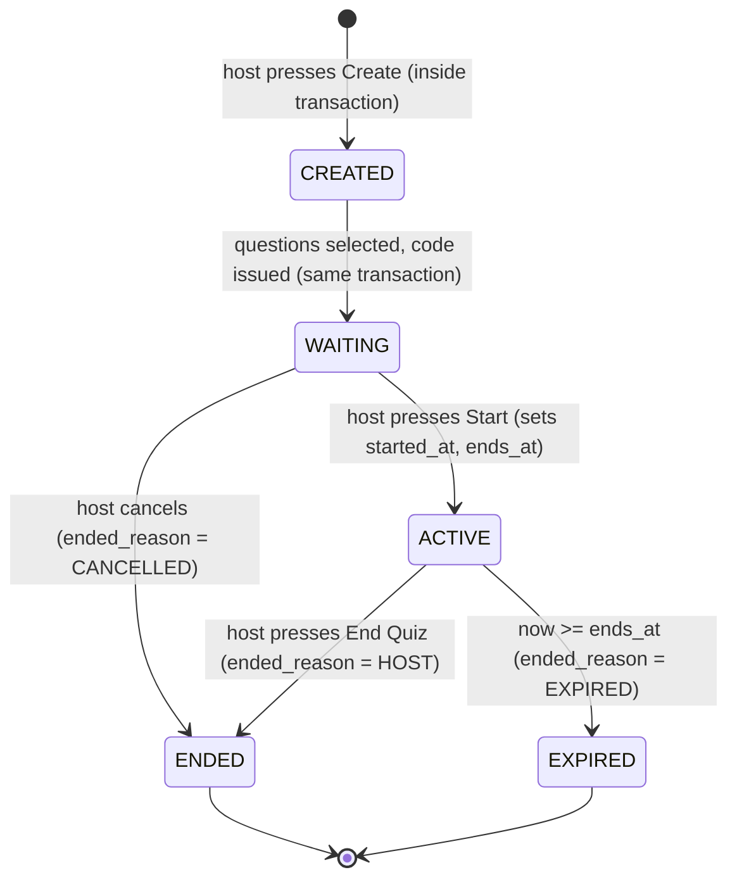
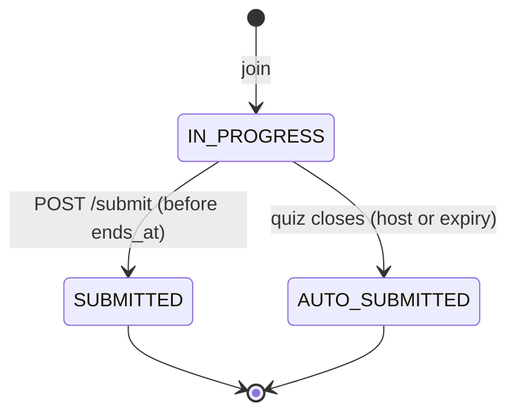
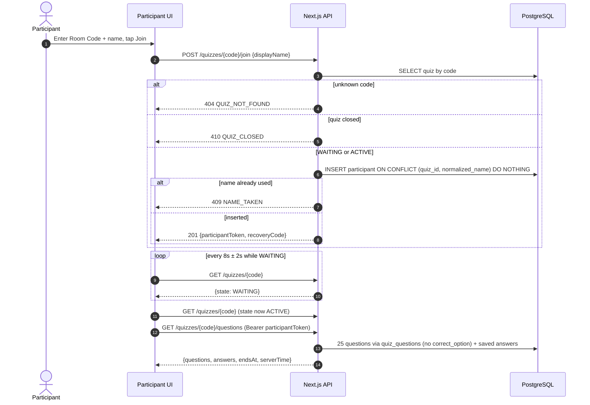
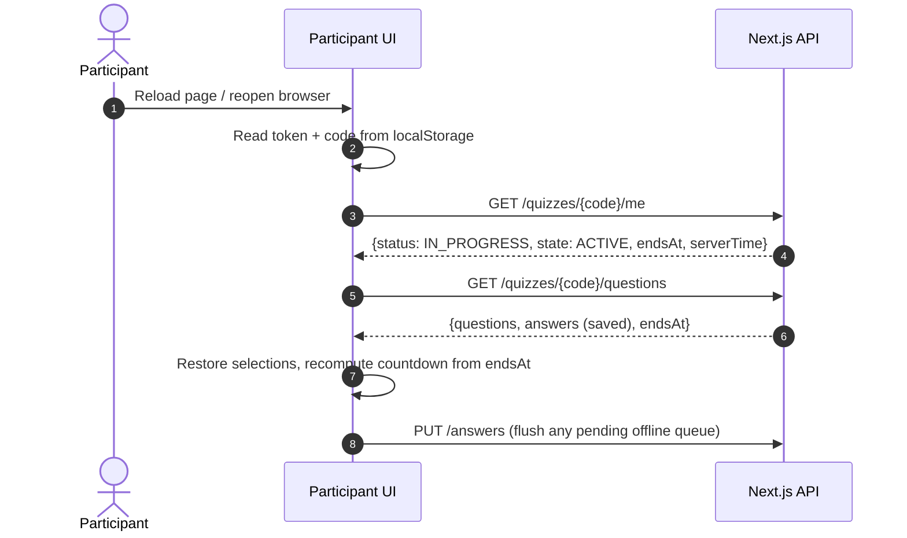
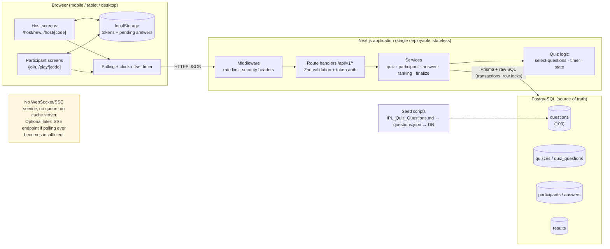

# Workflow — Quiz for IPL Auction

Technical and user workflow for the MVP defined in [`PRD.md`](./PRD.md). Terminology, state names, endpoint names and field names are identical to the PRD.

**Contents**
1. System Overview · 2. Host Workflow · 3. Participant Workflow · 4. Quiz State Lifecycle · 5. Timer Workflow · 6. Question Selection · 7. Answer Submission · 8. Ranking · 9. Host "End Quiz" · 10. Failure & Recovery · 11. Real-Time Communication · 12. Sequence Diagrams · 13. System Architecture · 14. Data Flow

---

## 1. System Overview

The application is a **single Next.js (App Router) project** deployed as one unit, backed by **one PostgreSQL database**.

- **Frontend:** React pages rendered by Next.js. Mobile-first, Tailwind CSS. The UI is a function of server state: the same route renders a different screen depending on `state` and the participant `status` returned by the API.
- **Backend:** Next.js route handlers under `/api/v1/*`. Thin handlers validate input (Zod), authenticate (token), and call **services** (`quiz`, `participant`, `answer`, `ranking`, `finalize`). Services talk to PostgreSQL through Prisma (and raw SQL where locking/ranking requires it).
- **Database:** PostgreSQL is the **only source of truth** for quiz state, deadlines, answers, scores and ranks. The app servers hold no authoritative state, so they can restart or scale horizontally.
- **Real-time:** none in the traditional sense. Short **polling** with adaptive intervals plus state piggy-backed on every save response (§11).
- **Trust model:** the browser is untrusted. It may display a countdown and queue answers, but the server decides state, time, score and rank.

Roles and credentials:

| Role | Credential | How obtained | Stored server-side as |
|---|---|---|---|
| Host | `hostToken` (32 random bytes, base64url) | Response of `POST /quizzes` (once) | `quizzes.host_token_hash` (SHA-256) |
| Participant | `participantToken` | Response of `POST /join` or `/rejoin` | `participants.token_hash` |
| Participant recovery | `recoveryCode` (6 chars) | Response of `POST /join` (once) | `participants.recovery_code_hash` |

---

## 2. Host Workflow

```text
Host opens application
 → Creates quiz (POST /quizzes)
 → System randomly selects 25 questions (stored in quiz_questions)
 → Generates Room Code + host token; quiz is WAITING
 → Host shares code (screen / QR / link)  — Participants join (lobby)
 → Host starts quiz (POST /quizzes/{code}/start)
 → Quiz timer starts (started_at = now, ends_at = now + 120 min; state ACTIVE)
 → Host sees participants/status (GET /host/dashboard, polled every 5 s)
 → Host monitors quiz (counts, progress, provisional ranking)
 → Host ends quiz (POST /end)  OR  timer expires (lazy expiry)
 → System locks submissions (state ENDED / EXPIRED)
 → Scores are finalised (recomputed for every participant)
 → Leaderboard is generated (ranks stored, is_final = true)
 → Participants can view final ranking
```

### Step detail

| # | Host action / system event | Server behaviour | Screen |
|---|---|---|---|
| 1 | Opens `/` and taps **Host a Quiz** | — | Landing → Create Quiz |
| 2 | Taps **Create Quiz** (optional title) | One DB transaction: check ≥ 25 active questions → select 25 → generate unique Room Code → generate host token → insert `quizzes` (state `CREATED`, flipped to `WAITING` before commit) and 25 `quiz_questions` rows | Spinner |
| 3 | Sees Room Code | Response returns `code`, `hostToken`. Client stores token in `localStorage` (`ipl-quiz:host:{code}`) and shows the **host link** `/host/{code}#t=<token>` with "Save this link" | Host Lobby |
| 4 | Participants join | Each join is an insert guarded by unique constraints | Lobby participant list updates every 5 s |
| 5 | Taps **Start Quiz** | `POST /start`: lock quiz row; if `WAITING` set `started_at = clock_timestamp()`, `ends_at = started_at + 7200 s`, state `ACTIVE`; if already `ACTIVE` return same values (idempotent) | Live Dashboard |
| 6 | Monitors | `GET /host/dashboard` every 5 s: counts and paginated rows; provisional rank computed over submitted participants | Live Dashboard ("Provisional") |
| 7a | Taps **End Quiz** → confirms | `POST /end` → `finalizeQuiz(reason = HOST)` (§9) | Final Leaderboard |
| 7b | *(or)* Timer reaches `ends_at` | First request after `ends_at` runs `finalizeQuiz(reason = EXPIRED)` | Final Leaderboard |
| 8 | Reads leaderboard | `GET /leaderboard` (stored ranks) | Final Leaderboard |

**Host refresh / new device:** the app reads `ipl-quiz:host:{code}` from `localStorage`; if missing, it reads the `#t=` fragment of the host link, stores it, and removes the fragment from the URL.

---

## 3. Participant Workflow

```text
Participant opens application
 → Enters name
 → Enters Quiz ID (Room Code)
 → Server validates room (exists, WAITING or ACTIVE, not full, name unique)
 → Participant joins (token + recovery code issued)
 → Lobby (if WAITING) → Questions are displayed when ACTIVE
 → Participant answers questions
 → Answers are saved (PUT /answers on every selection)
 → Participant submits quiz (POST /submit)
 → Server validates submission (state, deadline, status)
 → Score is calculated (provisional, hidden from participant)
 → Participant waits for quiz completion
 → Final leaderboard becomes visible (after host ends or timer expires)
```

### Step detail

| # | Step | Server behaviour | Client behaviour |
|---|---|---|---|
| 1 | Opens `/join` (or `/join?code=K7M2QX` from QR) | — | Auto-uppercases code; validates 6-char alphabet locally (UX only) |
| 2 | Submits code + name | `POST /join`: normalise code → find quiz → check state ∈ {`WAITING`,`ACTIVE`} → validate name → cap check → insert participant (`ON CONFLICT` on `(quiz_id, normalized_name)` ⇒ `NAME_TAKEN`) → generate token + recovery code | Stores `participantToken` under `ipl-quiz:{code}:participant`; shows recovery code once with "Write this down" |
| 3a | State `WAITING` | `GET /quizzes/{code}` returns state | Lobby message; polls every 8 s ± 2 s |
| 3b | State `ACTIVE` | `GET /questions` returns the 25 questions (no key) + saved answers + `endsAt` | Renders question 1 (or last unanswered) and starts countdown from `endsAt` |
| 4 | Selects an option | `PUT /answers` with `[{position, option}]` | Optimistic UI, "Saving… → Saved" indicator; failures go to the offline queue |
| 5 | Taps **Submit** | `POST /submit` (optional final snapshot) | Confirmation dialog if < 25 answered |
| 6 | Waiting | `GET /me` shows `status = SUBMITTED`; no score fields | "Answers submitted" screen; polls every 15 s |
| 7 | Quiz closes | `state` becomes `ENDED`/`EXPIRED`; `resultsReady = true` after finalisation | Auto-transition to the leaderboard; own row highlighted |

**Participant refresh / reopen:** the app loads `localStorage`, calls `GET /me`, and routes: `IN_PROGRESS` + `ACTIVE` → quiz; `SUBMITTED`/`AUTO_SUBMITTED` + `ACTIVE` → waiting; closed → leaderboard. If no token is found, it offers **Join** or **Recover** (name + recovery code).

---

## 4. Quiz State Lifecycle



`CREATED` is persisted only for the duration of the creation transaction; a quiz visible to any client is already `WAITING`. `ENDED` and `EXPIRED` are both **closed** states and behave identically for every endpoint; the difference is only the reason shown in the UI.

### Actions allowed per state

| Action | `CREATED` | `WAITING` | `ACTIVE` | `ENDED` / `EXPIRED` |
|---|:--:|:--:|:--:|:--:|
| Read public status | — | ✔ | ✔ | ✔ |
| Participant join / rejoin | ✘ | ✔ | ✔ | ✘ (`QUIZ_CLOSED`) |
| Host start | — | ✔ | ✔ idempotent | ✘ (`QUIZ_CLOSED`) |
| Host end | — | ✔ (cancel) | ✔ (finalise) | ✔ idempotent |
| Read questions | ✘ | ✘ (`INVALID_STATE`) | ✔ (if `IN_PROGRESS`) | ✘ (`QUIZ_CLOSED`) |
| Save answers | ✘ | ✘ | ✔ (if `IN_PROGRESS` and before `ends_at`) | ✘ (`QUIZ_CLOSED`) |
| Submit | ✘ | ✘ | ✔ (idempotent) | ✘ (`QUIZ_CLOSED`) |
| Host dashboard | — | ✔ | ✔ provisional | ✔ final |
| Leaderboard (host) | — | empty | ✔ provisional | ✔ final |
| Leaderboard (participant) | — | ✘ | ✘ (`FORBIDDEN`) | ✔ final (when `resultsReady`) |

### Participant status machine


Transitions are one-way; there is no path back to `IN_PROGRESS`, which is what makes restarting or re-attempting impossible.

---

## 5. Timer Workflow

**Principle:** the only authoritative timestamps are `quizzes.started_at` and `quizzes.ends_at`, written by the database clock. The browser never supplies or stores a start time.

### 5.1 Quiz start time and end time
At `POST /start` (inside a transaction holding a row lock):

```text
started_at = clock_timestamp()
ends_at    = started_at + duration_seconds   -- 7200 s = 2 hours
state      = 'ACTIVE'
```
The 2 hours begin when the host presses **Start**, not when the quiz is created, so lobby time is free.

### 5.2 Remaining-time calculation (client display only)
Every API response contains `serverTime`. On each response the client updates a clock offset:

```text
rtt        = tResponseReceived − tRequestSent          (client clock)
offset     = (serverTime + rtt/2) − tResponseReceived  (smoothed, e.g. keep the sample with lowest rtt)
remaining  = endsAt − (Date.now() + offset)
```
The UI renders `remaining` once per second. Because `endsAt` is server-provided and `offset` corrects for a wrong device clock, the display stays within ~1–2 s of the truth even if the phone clock is minutes off.

### 5.3 Browser refresh and reconnection
The countdown is recomputed from `endsAt` on every load (`GET /me` / `GET /questions`). Nothing about elapsed time is kept in the browser, so a refresh cannot reset or extend the timer. After reconnecting, the first successful response re-syncs the offset.

### 5.4 Server-side enforcement (the part that matters)
For every write (`PUT /answers`, `POST /submit`):

```text
BEGIN
  SELECT state, ends_at FROM quizzes WHERE id = $quiz FOR SHARE      -- waits if finalisation holds FOR UPDATE
  IF state <> 'ACTIVE'                       THEN reject QUIZ_CLOSED / INVALID_STATE
  IF clock_timestamp() >= ends_at            THEN reject QUIZ_CLOSED  (and trigger finalizeQuiz(EXPIRED) after the transaction)
  ... perform the write ...
COMMIT
```
There is **no grace period**: the safety net for slow networks is that every selection is already auto-saved, and the finalisation step auto-submits whatever was saved.

### 5.5 Expiry (lazy)
There is no timer thread or cron. State is derived from stored timestamps:

```text
effectiveState(quiz, now) = quiz.state == ACTIVE and now >= quiz.ends_at ? "EXPIRED (pending finalisation)" : quiz.state
```
Any request that observes `ACTIVE` with `now ≥ ends_at` calls `finalizeQuiz(EXPIRED)`. The participant client also fires an immediate `GET /quizzes/{code}` when its countdown reaches 0:00, and the host dashboard polls every 5 s, so finalisation normally happens within seconds of expiry. `ended_at` is set to `ends_at` (the logical close time), not to the moment finalisation ran.

### 5.6 Manual host termination
`POST /end` runs `finalizeQuiz(HOST)` immediately; `ended_at = clock_timestamp()` (never later than `ends_at`). From that commit on, writes are rejected.

### 5.7 Timeline

```mermaid
gantt
    title Quiz timeline (example)
    dateFormat HH:mm
    axisFormat %H:%M
    section Lobby (free)
    Participants join (WAITING)      :a1, 10:00, 15m
    section Active window (120 min)
    ACTIVE (started_at → ends_at)     :crit, a2, 10:15, 120m
    Late joiners allowed              :a3, 10:15, 120m
    section Close
    Finalise & publish leaderboard    :a4, 12:15, 5m
```



---

## 6. Question Selection Workflow

**When:** once, at quiz creation, inside the creation transaction.
**Where:** `src/server/quiz/select-questions.ts`.
**Why this way:** only the 100 ids are loaded (a few hundred bytes), selection is uniform and secure, and it is trivially unit-testable with an injectable RNG.

```text
function selectQuestions(activeIds: string[], count = 25, rng = crypto.randomInt): string[]
    if activeIds.length < count: throw QUESTION_BANK_INSUFFICIENT
    pool = copy(activeIds)
    for i = 0 .. count-1:                         // partial Fisher–Yates shuffle
        j = i + rng(pool.length - i)              // uniform integer in [i, length)
        swap(pool[i], pool[j])
    return pool[0 .. count-1]                     // distinct by construction
```

Persisting:

```text
BEGIN
  ids = SELECT id FROM questions WHERE is_active
  picked = selectQuestions(ids, 25)
  repeat up to 5 times: code = randomCode(6, ALPHABET); INSERT quizzes ... ON CONFLICT (code) DO NOTHING; stop when inserted
  INSERT INTO quiz_questions (quiz_id, position, question_id)
         VALUES (quizId, 1, picked[0]), ..., (quizId, 25, picked[24])
COMMIT
```

Guarantees:
- **No duplicates:** the shuffle yields distinct ids, and `UNIQUE(quiz_id, question_id)` enforces it in the database.
- **Same for everyone:** every participant reads the same `quiz_questions` rows ordered by `position`; selection never runs when a participant opens the quiz.
- **No bank leakage:** `GET /questions` joins only the quiz's 25 rows and selects explicit columns (no `correct_option`).

Bank maintenance: `IPL_Quiz_Questions.md` → `scripts/parse-questions.ts` → `data/questions/questions.json` → `prisma/seed.ts` (idempotent upsert by `id`). `scripts/validate-questions.ts` asserts: 100 questions, unique ids and texts, 4 distinct options, answer ∈ {A,B,C,D}, difficulty ∈ {Easy, Medium, Hard}.

---

## 7. Answer Submission Workflow

### 7.1 Selecting an answer
The user taps an option. The UI updates immediately (optimistic) and enqueues `{position, option}` in a small in-memory queue mirrored in `localStorage` (`ipl-quiz:{code}:pending`).

### 7.2 Saving answers
```text
client: debounce ≤ 300 ms → PUT /quizzes/{code}/answers { answers: [{position, option}, ...] }
server (one transaction):
   lock quiz row FOR SHARE; check ACTIVE and clock_timestamp() < ends_at
   verify participant (token) belongs to this quiz and status = IN_PROGRESS   (row lock FOR UPDATE on participant)
   for each item: option = null → DELETE answers row
                  else          → INSERT ... ON CONFLICT (participant_id, position) DO UPDATE selected_option, saved_at = now
   respond { saved, answeredCount, state, endsAt, serverTime }
```
- The request is **idempotent and last-write-wins** per question; retrying is always safe.
- The response includes `state`, so a participant learns that the quiz ended as soon as their next save (or poll) returns.
- On failure the item stays in the queue; retry with exponential backoff (1 s, 2 s, 4 s … capped at 30 s) and on the `online` event.

### 7.3 Validating answers
Zod schema: `position` integer 1–25, `option` one of `A|B|C|D|null`, at most 25 items, unique positions, body ≤ 8 KB. The database re-checks with `CHECK` constraints. The client never sends correctness, score or time.

### 7.4 Final submission
```text
POST /quizzes/{code}/submit { answers?: [...] }
BEGIN
  lock quiz FOR SHARE; require ACTIVE and clock_timestamp() < ends_at      (else QUIZ_CLOSED)
  lock participant row FOR UPDATE
  IF status <> IN_PROGRESS: COMMIT and return 200 with the original submittedAt        -- idempotent duplicate
  apply optional final answers snapshot
  UPDATE participants SET status = 'SUBMITTED', submitted_at = clock_timestamp()
  compute provisional result (score query below) → UPSERT results (is_final = false, rank = null)
COMMIT
respond { status, submittedAt, answeredCount }          -- no score
```

### 7.5 Score calculation (single set-based query)

```sql
-- per participant (provisional) or for all participants of a quiz (finalisation)
SELECT p.id AS participant_id,
       COUNT(*) FILTER (WHERE a.selected_option = q.correct_option)                    AS correct_count,
       COUNT(*) FILTER (WHERE a.selected_option IS NOT NULL
                          AND a.selected_option <> q.correct_option)                   AS incorrect_count,
       25 - COUNT(a.position)                                                          AS unanswered_count
FROM participants p
JOIN quiz_questions qq ON qq.quiz_id = p.quiz_id
JOIN questions q       ON q.id = qq.question_id
LEFT JOIN answers a    ON a.participant_id = p.id AND a.position = qq.position
WHERE p.quiz_id = $1            -- or p.id = $2 for a single participant
GROUP BY p.id;
-- score = correct_count (1 point each, no negative marking)
```

### 7.6 Preventing duplicate submission
Five independent layers:
1. **Status machine:** `IN_PROGRESS → SUBMITTED` is one-way.
2. **Row lock:** concurrent submits serialise on the participant row; only the first transitions.
3. **Idempotent response:** later calls return the original `submittedAt`.
4. **Schema:** `results.participant_id` is the primary key ⇒ at most one result per participant.
5. **Client:** the Submit button disables after the first tap and the questions endpoint refuses (`ALREADY_SUBMITTED`) afterwards.

---

## 8. Ranking Workflow

1. **Score:** `correct_count` (1 point per correct answer; 0 for wrong/unanswered; max 25).
2. **Completion time:**
   ```text
   effective_start = GREATEST(participants.joined_at, quizzes.started_at)
   time_taken_ms   = EXTRACT(EPOCH FROM (participants.submitted_at − effective_start)) × 1000
   ```
   For `AUTO_SUBMITTED` participants `submitted_at = quizzes.ended_at`.
3. **Tie-break:** higher score first; equal score ⇒ smaller `time_taken_ms` first.
4. **Final rank (computed once at close):**
   ```sql
   UPDATE results r
   SET rank = x.rnk, is_final = true
   FROM (
     SELECT participant_id,
            RANK() OVER (ORDER BY score DESC, time_taken_ms ASC) AS rnk
     FROM results WHERE quiz_id = $1
   ) x
   WHERE r.participant_id = x.participant_id;
   ```
   Exact ties (same score *and* same millisecond time) share a rank (1, 2, 2, 4). Display order within equal ranks is stable by `joined_at`, then `participant_id`.
5. **Provisional rank (host only, while `ACTIVE`):** the same `RANK()` expression evaluated on read over `results WHERE quiz_id = $1 AND is_final = false` (submitted participants only), covered by index `results(quiz_id, score DESC, time_taken_ms ASC)`. Never stored, never sent to participants.
6. **Reading the leaderboard:** `GET /leaderboard` reads stored `rank`, ordered by `rank, joined_at`, with `limit/offset` pagination (default 50, max 100). The caller's own row is returned with `isYou: true` (and included even if outside the page window for participants).

---

## 9. Host "End Quiz" Workflow

The host presses **End Quiz** and confirms the dialog. `POST /quizzes/{code}/end` runs `finalizeQuiz(quizId, reason)` — the same function used by lazy expiry.

```text
function finalizeQuiz(quizId, reason /* HOST | EXPIRED */):
  BEGIN
    quiz = SELECT * FROM quizzes WHERE id = quizId FOR UPDATE      -- NOWAIT on read paths (see below)
    IF quiz.state IN (ENDED, EXPIRED): COMMIT; return quiz         -- idempotent; second caller does nothing
    IF quiz.state = WAITING (host cancel):
         UPDATE quizzes SET state='ENDED', ended_at=now, ended_reason='CANCELLED'; COMMIT; return
    -- state is ACTIVE
    closeAt = (reason = HOST) ? LEAST(clock_timestamp(), quiz.ends_at) : quiz.ends_at
    1. LOCK:     UPDATE quizzes SET state = (reason=HOST ? 'ENDED' : 'EXPIRED'),
                        ended_at = closeAt, ended_reason = reason          -- new writes are now rejected
    2. AUTO-SUBMIT: UPDATE participants SET status='AUTO_SUBMITTED', submitted_at = closeAt
                    WHERE quiz_id = quizId AND status = 'IN_PROGRESS'
    3. SCORE:    INSERT INTO results (...) <score query §7.5 for all participants, incl. time_taken_ms>
                 ON CONFLICT (participant_id) DO UPDATE SET score=..., correct_count=..., incorrect_count=...,
                                                          unanswered_count=..., time_taken_ms=...   -- authoritative recompute
    4. RANK:     UPDATE results SET rank = RANK() ..., is_final = true   (§8)
  COMMIT
```

| Concern | How it is handled |
|---|---|
| **Locking the quiz** | `FOR UPDATE` on the quiz row. Answer/submit writes hold `FOR SHARE` for their short transaction, so they either finish before finalisation starts or wait and then see the closed state. |
| **Rejecting new submissions** | After commit, `state` is closed ⇒ every write returns `QUIZ_CLOSED` (410). |
| **Finalising scores** | Step 3 recomputes every participant from `answers` (not trusting provisional scores). Stragglers are auto-submitted with whatever they saved. |
| **Generating rankings** | Step 4 stores `rank` and sets `is_final = true`. |
| **Publishing the leaderboard** | There is no separate publish step: `GET /leaderboard` allows participants once `state` is closed and results are final (`resultsReady = true`). |
| **Updating participant screens** | The next save response or poll returns `state: ENDED`; the client then shows the "Quiz ended — calculating results" screen and polls `GET /me` until `resultsReady`, then loads the leaderboard. Worst-case delay ≈ 30 s (the in-quiz poll interval). |
| **Idempotency** | Pressing the button twice, or two host tabs, results in one finalisation. |
| **Many pollers at expiry** | Read paths try `FOR UPDATE NOWAIT`; if another request is already finalising they immediately return `state: EXPIRED, resultsReady: false` instead of queuing — avoiding a thundering herd of 500 pollers. |
| **Performance** | One transaction with 4 set-based statements over ≤ 500 × 25 answer rows; target ≤ 5 s (expected well under 1 s). |

---

## 10. Failure and Recovery Workflow

| Failure | What happens | Recovery |
|---|---|---|
| **Participant refreshes** | Page reloads, state is lost client-side | App reads token from `localStorage` → `GET /me` → routes to quiz / waiting / leaderboard; `GET /questions` restores saved answers; countdown recomputed from `endsAt`. |
| **Host refreshes** | Dashboard reloads | Host token from `localStorage` → `GET /host/dashboard`. Quiz and timer are untouched (server-side). |
| **Internet disconnects (participant)** | Requests fail | Banner "Connection lost – answers are saved on this device"; selections continue locally; queue flushes with backoff and on `online`. If the quiz closes meanwhile, queued writes get `QUIZ_CLOSED` and are dropped; everything already saved counts. |
| **Internet disconnects (host)** | Dashboard goes stale | "Last updated Ns ago" indicator turns amber; polling resumes automatically. The quiz still auto-closes at `ends_at`. |
| **Server temporarily fails / restarts / redeploys** | In-flight requests fail with 5xx/network errors | No authoritative state is in memory. Clients retry with backoff; the next successful request reads state from PostgreSQL. A finalisation interrupted mid-transaction is rolled back atomically and simply re-runs on the next trigger. |
| **Database request fails** | Handler returns `500 INTERNAL`; transaction rolls back | No partial writes. Client keeps the pending answers and retries. The service logs the error with a request id. |
| **Database unavailable for a while** | All calls fail | Health endpoint reports 503; clients keep retrying and keep answers locally. When the DB returns, queued answers are saved (if before `ends_at`). Deadline is stored, so time keeps "counting" correctly. |
| **Browser closes** | Tab gone | Reopen the site: `localStorage` token persists ⇒ resume. If storage was cleared or another device is used: **Recover** with display name + recovery code (`POST /rejoin`), which issues a new token. |
| **Host loses token** | No controls | Open the saved host link; otherwise the quiz still closes automatically at `ends_at` (limitation). |
| **Expiry occurs while nobody polls** | State stays `ACTIVE` in the row | Safe: every read/write evaluates `now ≥ ends_at` and finalises; derived state is always correct. |
| **Two finalisers race** | Both try to close | Row lock + state check ⇒ one closes, the other is a no-op. |
| **Client clock wrong** | Local countdown drifts | Offset correction from `serverTime`; enforcement is server-side regardless. |

---

## 11. Real-Time Communication

### 11.1 What needs real-time updates?

| Information | Direction | Tolerable latency | Frequency of change |
|---|---|---|---|
| Quiz started | server → participants | ≤ ~10 s | once |
| Lobby participant list / count | server → host | ≤ ~5–10 s | during lobby |
| Quiz ended (host/expiry) | server → participants | ≤ ~30 s | once |
| Live provisional ranking and progress | server → host | ≤ ~5–10 s | continuous but soft |
| Final leaderboard availability | server → all | ≤ ~10–30 s | once |
| Answers | participants → server | immediate | on tap (a normal request, not a push) |

### 11.2 Options compared

| Option | Fit | Decision |
|---|---|---|
| **Polling** | Works everywhere (campus proxies/firewalls), no connection state, serverless-friendly, recovery after disconnect is automatic | **Chosen** |
| Server-Sent Events | Simple one-way push, but long-lived connections are a poor fit for serverless hosting and add reconnect logic | Not needed |
| WebSockets / Socket.IO | Bidirectional push; needs stateful servers and sticky sessions or an adapter at scale | Not needed |

### 11.3 Polling plan (constants in `src/lib/config.ts`)

| Client / screen | Endpoint | Interval | Notes |
|---|---|---|---|
| Participant in lobby | `GET /quizzes/{code}` | 8 s ± 2 s jitter | Jitter avoids synchronised bursts |
| Participant answering | *(piggy-back)* `PUT /answers` responses + `GET /quizzes/{code}` | every 30 s + immediately at countdown 0:00 | State comes with every save |
| Participant after submit | `GET /me` | 15 s | Until closed and `resultsReady` |
| Participant after close | `GET /me` → `GET /leaderboard` | 3 s until `resultsReady`, then once | Short burst |
| Host lobby / dashboard | `GET /host/dashboard` | 5 s | Paginated (50 rows) |
| Hidden tab | any | ×3 interval (Page Visibility API) | Saves battery and server load |

Server-side optimisations: a 1–2 s in-process micro-cache for `GET /quizzes/{code}` (public data only), `ETag`/`304` for the leaderboard, indexed single-query handlers, and generous-but-bounded rate limits.

Load estimate for 300 participants: lobby ≈ 300 / 8 s ≈ 38 req/s (briefly); in-quiz ≈ 300 / 30 s ≈ 10 req/s for polls plus autosaves (≈ 1 write per answer, i.e. a few per second); host ≈ 0.2 req/s.

---

## 12. End-to-End Sequence Diagrams

### 12.1 Create quiz and start

```mermaid
sequenceDiagram
    autonumber
    actor Host
    participant UI as Host UI (browser)
    participant API as Next.js API
    participant DB as PostgreSQL

    Host->>UI: Tap "Create Quiz"
    UI->>API: POST /api/v1/quizzes {title?}
    API->>DB: BEGIN
    API->>DB: SELECT id FROM questions WHERE is_active
    DB-->>API: 100 ids
    API->>API: selectQuestions(ids, 25) (secure shuffle)
    API->>DB: INSERT quizzes (code, host_token_hash, state=WAITING) ON CONFLICT(code) retry
    API->>DB: INSERT 25 quiz_questions (position 1..25)
    API->>DB: COMMIT
    API-->>UI: 201 {code, hostToken, state: WAITING}
    UI->>UI: Save token (localStorage), show Room Code + host link
    Host->>UI: Tap "Start Quiz"
    UI->>API: POST /quizzes/{code}/start (Bearer hostToken)
    API->>DB: SELECT ... FOR UPDATE; set started_at, ends_at, state=ACTIVE
    DB-->>API: ok
    API-->>UI: 200 {state: ACTIVE, startedAt, endsAt, serverTime}
```

### 12.2 Join (lobby or late) and load questions



### 12.3 Answer, submit

```mermaid
sequenceDiagram
    autonumber
    actor P as Participant
    participant UI as Participant UI
    participant API as Next.js API
    participant DB as PostgreSQL

    P->>UI: Select option for Q7
    UI->>UI: Optimistic update + queue (localStorage)
    UI->>API: PUT /answers {answers:[{position:7, option:"C"}]}
    API->>DB: BEGIN; quiz FOR SHARE (ACTIVE and now < ends_at?)
    API->>DB: participant FOR UPDATE (IN_PROGRESS?)
    API->>DB: UPSERT answers (participant_id, 7)
    API->>DB: COMMIT
    API-->>UI: 200 {answeredCount, state: ACTIVE, endsAt}
    P->>UI: Tap Submit (confirm)
    UI->>API: POST /submit {answers?}
    API->>DB: BEGIN; quiz FOR SHARE; participant FOR UPDATE
    alt already submitted
        API-->>UI: 200 {original submittedAt}
    else first submission
        API->>DB: status=SUBMITTED, submitted_at=now; compute provisional score; UPSERT results
        API->>DB: COMMIT
        API-->>UI: 200 {status: SUBMITTED, submittedAt}  (no score)
    end
```

### 12.4 Host ends the quiz (or expiry) and results are shown

```mermaid
sequenceDiagram
    autonumber
    actor Host
    participant HUI as Host UI
    participant PUI as Participant UI
    participant API as Next.js API
    participant DB as PostgreSQL

    Host->>HUI: Tap "End Quiz" and confirm
    HUI->>API: POST /quizzes/{code}/end (host token)
    API->>DB: BEGIN; SELECT quiz FOR UPDATE
    API->>DB: state=ENDED, ended_at, ended_reason=HOST
    API->>DB: AUTO_SUBMIT IN_PROGRESS participants (submitted_at = ended_at)
    API->>DB: INSERT/UPDATE results (recompute all scores + time_taken_ms)
    API->>DB: UPDATE results SET rank = RANK() OVER (score DESC, time_taken_ms ASC), is_final = true
    API->>DB: COMMIT
    API-->>HUI: 200 {state: ENDED, resultsReady: true}
    HUI->>API: GET /leaderboard
    API-->>HUI: final ranking
    PUI->>API: PUT /answers or GET /quizzes/{code} (next save/poll)
    API-->>PUI: state: ENDED (410 QUIZ_CLOSED for writes)
    PUI->>API: GET /me (poll until resultsReady)
    API-->>PUI: {resultsReady: true, result: {rank, score}}
    PUI->>API: GET /leaderboard
    API-->>PUI: final ranking (own row highlighted)
```

### 12.5 Lazy expiry

```mermaid
sequenceDiagram
    autonumber
    participant C as Any client (poll / save)
    participant API as Next.js API
    participant DB as PostgreSQL

    C->>API: GET /quizzes/{code}
    API->>DB: SELECT quiz
    DB-->>API: state=ACTIVE, ends_at in the past
    API->>DB: BEGIN; SELECT ... FOR UPDATE NOWAIT
    alt lock acquired
        API->>DB: finalizeQuiz(EXPIRED): ended_at = ends_at, auto-submit, score, rank
        API->>DB: COMMIT
        API-->>C: {state: EXPIRED, resultsReady: true}
    else another request is finalising
        API-->>C: {state: EXPIRED, resultsReady: false}  (client polls again in ~3 s)
    end
```

### 12.6 Refresh / reconnect



---

## 13. System Architecture



Deployment view: `Browser ⇄ CDN/Edge (static assets) ⇄ Next.js on serverless/Node host ⇄ managed PostgreSQL (pooled connection)`. Environment variables: `DATABASE_URL`, `APP_URL`, `TOKEN_PEPPER`, `MAX_PARTICIPANTS`, `QUIZ_DURATION_SECONDS` (default 7200), `QUESTION_COUNT` (default 25).

---

## 14. Data Flow

```text
1. QUESTION BANK (offline)
   IPL_Quiz_Questions.md → parse-questions.ts → questions.json → prisma seed → table questions (100 rows)

2. QUIZ CREATION
   Host UI → POST /quizzes → [select 25 ids, generate code + host token]
          → quizzes (1 row) + quiz_questions (25 rows) → response {code, hostToken}

3. JOINING
   Participant UI → POST /join {name} → participants (1 row, hashed token) → response {token, recoveryCode}

4. STARTING
   Host UI → POST /start → quizzes.started_at, ends_at, state = ACTIVE

5. ANSWERING
   Participant UI → GET /questions → (quiz_questions ⨝ questions, key excluded) → 25 DTOs + saved answers
   Participant UI → PUT /answers → answers (upsert, ≤ 25 rows per participant)

6. SUBMITTING
   Participant UI → POST /submit → participants.status = SUBMITTED, submitted_at
                                  → results (provisional: score, counts, time_taken_ms, rank = null)

7. MONITORING (host only)
   Host UI → GET /host/dashboard → counts from participants.status + provisional RANK() over results

8. CLOSING
   Host POST /end  OR  first request after ends_at
        → quizzes.state = ENDED/EXPIRED, ended_at
        → participants: IN_PROGRESS → AUTO_SUBMITTED
        → results: authoritative recompute from answers ⨝ quiz_questions ⨝ questions.correct_option
        → results.rank, is_final = true

9. RESULTS
   Participant/Host UI → GET /me, GET /leaderboard → stored ranks, paginated, display names and scores only
```

**What crosses the network, by direction**

| Direction | Data | Never included |
|---|---|---|
| Client → Server | room code, display name, tokens, `{position, option}` pairs | score, rank, correctness, timestamps |
| Server → Participant | question text and options, own saved answers, `endsAt`/`serverTime`, state, (after close) rank/score/leaderboard | correct options, other participants' answers, tokens, hashes |
| Server → Host | counts, participant names/progress/scores/provisional rank, state/timing | correct options, participant tokens/recovery codes |
